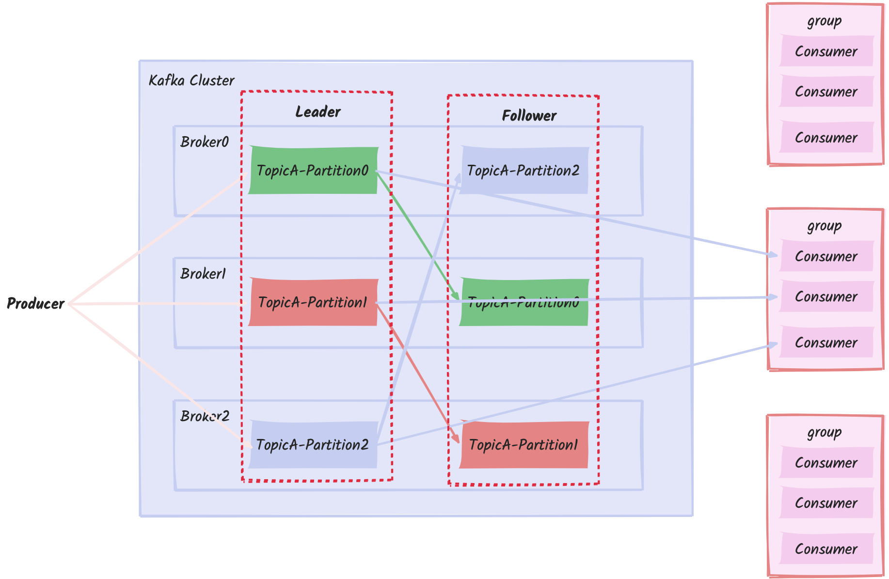

# Kafka

## 名词介绍



- Topic: 消息队列，生产者和消费者面向的都是一个Topic
- Broker: 一个Kafka服务器就是一个Broker，一个集群由多个Broker组成。一个Broker可以容纳多个Topic
- Producer: 消息生产者，向Kafka Broker发生消息的客户端
- Consumer: 消息消费者，向Kafka Broker取消息的客户端
- Consumer Group(CG): 消费者组，有多个Consumer组成。消费者组内每个消费者负责不同分区的数据，一个分区只能有一个组内消费者消费；消费者组之间互不影响。所有消费者都属于某一个消费者组
- Partition: 为了实现扩展性，一个非常大的Topic可以分布到多个Broker上，一个topic可以分为多个partition
- Replica: 副本，每一个分区都有若干个副本，保证系统的稳定性
- Leader: 分区副本的“领导者”，生产者发送数据的对象，消费者消费数据的对象
- Follower: 分区副本的“从”，保持和Leader数据的同步。Leader发送故障，会从Follower中选举新的Leader

## Kafka集群安装

使用docker对Kafka进行集群安装，[docker-compose.yaml](./cluster/docker-compose.yaml)

```shell
# 切换到目标目录
# 目录结构
#.
#├── docker-compose.yaml
#│
#├── kafka_data1
#│
#├── kafka_data2
#│
#├── kafka_data3
#│
#├── zookeeper_data1
#│
#├── zookeeper_data2
#│
#└── zookeeper_data3
# 启动
docker-compose up -d
```

### 配置
详情见[server.properties](./singleton/server.poperties)配置

## 操作命令

进入容器`docker exec -it kafka1 /bin/bash`

### Topic

可以使用`kafka-topics.sh`查看操作主题的命令，常用命令如下

| 参数                                                   | 描述                         |
|------------------------------------------------------|----------------------------|
| `--bootstrap-server <String: server to connect to>`  | 连接的 Kafka Broker 主机名称和端口号。 |
| `--topic <String: topic>`                            | 操作的主题名称。                   |
| `--create`                                           | 创建主题。                      |
| `--delete`                                           | 删除主题。                      |
| `--alter`                                            | 修改主题配置。                    |
| `--list`                                             | 列出所有主题。                    |
| `--describe`                                         | 查看指定主题的详细信息。               |
| `--partitions <Integer: # of partitions>`            | 设置主题的分区数量（仅在创建主题时使用）。      |
| `--replication-factor <Integer: replication factor>` | 设置分区的副本因子（仅在创建主题时使用）。      |
| `--config <String: name=value>`                      | 更新或设置主题的配置参数。              |

```shell
# 创建一个主题
kafka-topics.sh --bootstrap-server kafka1:9093 --create --partitions 1 --replication-factor 3 --topic first
## --partitions 分区数
## --replication-factor 副本数
## --topic 主题名称

# 查看主题列表
kafka-topics.sh --bootstrap-server kafka1:9093 --list

# 查看主题详情
kafka-topics.sh --bootstrap-server kafka1:9093 --describe --topic first
Topic: first	TopicId: nmM8zHmmRsqm5WjhTXuYHw	PartitionCount: 1	ReplicationFactor: 3	Configs: 
	Topic: first	Partition: 0	Leader: 2	Replicas: 2,3,1	Isr: 2,3,1	Elr: N/A	LastKnownElr: N/A
## TopicId Topic 唯一标识符（UUID）
## Partition: 0 Topic 中的第一个分区（编号从 0 开始） 
## Leader: 2 分区 0 的 Leader 是 Broker 2

# 修改分区数，分区数只能增加，不能减少
kafka-topics.sh --bootstrap-server kafka1:9093 --alter --topic first --partitions 3
# 删除分区
kafka-topics.sh --bootstrap-server kafka1:9093 --topic first --delete
```

### Producer

可以使用`kafka-console-producer.sh`查看生产者的命令，常用命令如下

| 参数                                                   | 描述                         |
|------------------------------------------------------|----------------------------|
| `--bootstrap-server <String: server to connect to>`  | 连接的 Kafka Broker 主机名称和端口号。 |
| `--topic <String: topic>`                            | 操作的主题名称。                   |

```shell
# 生产消息
kafka-console-producer.sh --bootstrap-server kafka2:9094 --topic first
```

#### 发送消息流程

[生产者代码](./src/main/java/com/coding/w/producer/MyProducer.java)

1. `kafkaProducer`需要配置一些基本的参数，比如 Kafka 集群的地址、序列化方式、重试策略等
2. 发送消息，当`batch.size=16k || linger.ms = 0ms`时会调用`send()`方法将消息发送到指定的 topic 和 partition
3. 发送请求到`Broker Kafka`生产者将序列化后的消息发送给目标broker。生产者与Kafka broker之间的通信通常基于TCP协议，生产者发送的消息会经过 Kafka 的网络层，最终到达目标 broker
4. 确认机制`acks`  
   - `acks=0`：生产者不等待确认，发送后就认为消息发送成功。
   - `acks=1`：生产者等待 leader 节点的确认，消息在 leader 节点写入成功后返回确认。
   - `acks=all`（或 `acks=-1`）：生产者等待所有副本的确认，只有所有副本都成功写入后才返回确认，保证消息的持久性。
5. 错误处理与重试，如果消息发送失败，Kafka 生产者会根据 retries 配置进行重试

#### 生产数据可靠性

主要设置`acks`应答级别可以解决
- `acks=0`：生产者不等待确认，发送后就认为消息发送成功。可靠性差，效率高
- `acks=1`：生产者等待 leader 节点的确认，消息在 leader 节点写入成功后返回确认。可靠性中等，效率中等
- `acks=all`（或 `acks=-1`）：生产者等待所有副本的确认，只有所有副本都成功写入后才返回确认，保证消息的持久性。可靠性高，效率低，数据可能会重复

#### 幂等性
幂等性是指Producer不论向Broker发送多少次重复数据，Broker只会持久化一条
重复数据的判断标准：具有<PID,Partition,SeqNumber>相同主键的消息提交时，Broker只会持久化一条。其中PID是Kafka每次重启都会分配一个新的；Partition表示分区号；SeqNumber是单调递增的
开启参数 `enable.idempotence` 默认为 true，false关闭


### Broker

#### 工作流程

1. Kafka 启动成功后，会在zk中注册
2. 注册的先后顺序可以争夺leader,broker 获取Controller权限
3. 选举出Controller之后，监听Brokers节点变化
4. Controller决定Leader选举，选举规则：在isr中存活为前提。按照AR中排在前面的优先
5. Controller将节点信息上传到ZK上
6. 其他Controller同步Leader Controller 信息

如果Brokers中的Leader挂了，根据第4点的选举规则，选举新的Leader，更新Leader，以及isr

### Kafka副本

Kafka副本主要作用，提高数据可靠性  
Kafka默认1个副本，生产环境一般配置2个  
Kafka分区中的所有副本统称为AR(Assigned Repllicas)  
AR = isr + osr

isr: 表示和Leader保持同步的Follower集合。如果Follower长时间未向Leader发送通信请求或同步数据（**30s**），则该Follower将被踢出isr

osr: 表示Follower与Leader副本同步时，延迟过多的副本

#### Kafka 文件存储机制
Topic是逻辑上的概念，而partition是物理上的概念，每一个partition对应一个log文件，该log文件中存储的就是Producer生产的数据。Producer生产的数据会被不断追加到该log文件末端，为防止log文件过大导致数据定位效率低下，Kafka采取了分片和索引机制，将每个partition分为多个segment。每一个segment包含：".index"文件、".log"文件、".timeindex"文件。

Kafka存储日志的索引使用的是稀疏索引，大约每往log文件写入4kb数据，会往index文件写入一条索引

Kafka集群日志，默认7天后被清除，清楚策略有两种：删除、压缩策略

- delete 删除日志，`log.cleanup.policy=delete`，基于时间或者基于大小
- compact 日志压缩，对于相同key的不同的value值，保留最后一个版本

#### Kafka高效读写数据

1. Kafka本身是分布式集群，可以采用分区技术，并行度高
2. 读数据采用稀疏索引，可以快速定位要消费的数据
3. 顺序写磁盘，Kafka的producer生产数据，要写入到log文件中，写的过程是一只追加到文件末端，为顺序写
4. 零拷贝和页缓存(操作系统缓存)

#### 数据积压，提高Kafka吞吐量

1. 增加分区，增加消费者个数
2. 提高生产者吞吐量，修改参数配置  
   - `batch.size`批次大小，默认16k
   - `linger.ms`等待时间，默认0ms
   - `compression.type`压缩snappy
   - `RecordAccumulator`缓冲区大小，默认32m
3. 提高消费者吞吐量，修改参数配置  
   - `fetch.max.bytes` 增加消费者一次拉取的消息条数，默认50m
   - `max.poll.records` 增加一次poll拉取数据返回消息的最大条数


### Consumer

#### 消费方式
- pull（拉）模式，消费只主动拉去消息，Kafka采用这一个
- push（推）模式，集群推送消息到消费者，网络消耗比较大

#### 常用操作

可以使用`kafka-console-consumer.sh`查看生产者的命令，常用命令如下

| 参数                                                  | 描述                         |
|-----------------------------------------------------|----------------------------|
| `--bootstrap-server <String: server to connect to>` | 连接的 Kafka Broker 主机名称和端口号。 |
| `--topic <String: topic>`                           | 操作的主题名称。                   |
| `--from-beginning`                                  | 从头开始消费                     |
| `--group <String: consumer group id>`               | 指定消费者组名称                   |


```shell
# 接收消息
## 注意如果没有--from-beginning 参数，不会获取到订阅之前的消息
## 先订阅再有消息
kafka-console-consumer.sh --bootstrap-server kafka2:9094 --topic first --from-beginning
```

#### Consumer Group 消费者组
由多个consumer组成，形成一个消费者组的条件，消费者组的groupid相同  
- 消费者组内每个消费者负责消费不同分区的数据，一个分区只能由一个组内消费者消费
- 消费者组之间互不影响。所有消费者都属于某个消费者组，即**消费者组是逻辑上的一个订阅者**

#### 消费消息流程
1. 配置消费者配置，集群地址、key和value的反序列化、组名
2. 消费者订阅主题
3. [消费者初始化](#消费者组初始化流程)，分区分配
4. 消费者拉取数据（poll循环）
5. 消费数据（消息处理）
6. 提交偏移量，分为自动提交，和手动提交，手动提交有分为同步提交和异步提交
7. 消费者故障和再平衡

##### 消费者组初始化流程
使用`coordinator`辅助实现消费者组的初始化和分区，每一个broker都有`coordinator`。选择一个`coordinator`作为集群的leader

1. 每一个消费者都会发送一个JoinGroup请求，发送至`coordinator` leader
2. 随机选一个consumer作为leader
3. 把要消费的topic情况发送给消费者leader
4. 消费者leader制定消费方案
5. 把消费方案发给`coordinator`
6. `coordinator`把消费方案发送给各个consumer
7. 每一个消费者都会和`coordinator`保持心跳(3ms)，一旦超时(45s)，该消费者会被移除，并触发再平衡（[重新分配任务](#消费者分区分配)），或者消费者处理消息的时间过长（超过5分钟）

##### 消费者组详细消费流程

1. 消费者发送消费请求到`ConsumerNetworkClient`
2. `ConsumerNetworkClient`会每批次抓数据，当数据达到`fetch.min.bytes`大小或者`fetch.max.wat.ms`时间
3. 抓去数据成功回调，进过序列化到达消费者

##### 消费者分区分配

一个consumer group中有多个consumer组成，一个topic有多个partition组成，哪一个consumer来消费哪个partition的数据  
Kafka有四种主流分区分配策略：Range、RoundRobin、Sticky、CooperativeSticky  

通过`partition.assignment.strategy`配置分区分配策略，默认策略是Range+CooperativeSticky

###### Range分区
对于每一个topic都是“均分”，将分区均分给消费者，余的分区分给靠前的消费者

例如：8个分区，分给三个消费者，前两个消费者分的3个分区，最后一个消费者分两个分区

缺点：在**45s**内停掉消费者A，随机由一个分区会直接承担消费者A的分区数据。从而造成数据倾斜  

这里的45s是指分区`coordinator`的心跳机制，会重新分配

###### RoundRobin
RoundRobin 针对所有Topic去轮训分区策略，把所有partition和所有的consumer都列出来，然后按照 hashcode 进行排序，最后通过轮询算法来分配  

例如：8个分区，分给三个消费者A、B、C  
A:0、3、6  
B:1、4、7  
C:2、5  

停掉A分区之后，45秒内分区产生的数据，消费者A负责的分区会被轮询的分给B、C

###### Sticky 分区
粘性分区定义：分配的结果带有“粘性的”，即在执行一次新的分配之前，考虑上一次分配的结果，尽量少的调整分配的变动。**将分区随机均匀的分配给所有的消费者**。

#### offset
offset 保存着消费者消费数据的位移，从0.9版本开支，consumer将offset保存在Kafka一个内置的topic中，该topic为_consumer_offsets中，在此之前的版本，是存储在Zookeeper中。保存在Kafka中的目的是降低I/O...  

_consumer_offsets主题里面采用key和value的方法存储数据
key是group.id+topic+分区号，value是当前offset的值  

修改配置文件`consumer.properties`，添加`exclude.internal.topics=false`，默认是true，表示不能消费系统主题。查看事例如下
```shell
# 创建一个新的topic
kafka-topics.sh --bootstrap.server kafka1:9093 --create --topic test_offset --partitions 2 --replication-factor 2
# 启动生产者,并生产数据
kafka-console-producer.sh --topic test_offset --bootstrap.server kafka1:9093
# 启动消费者消费数据
kafka-console-consumer.sh --bootstrap.server kafka1:9093 --topic test_offset --group test

# 查看消费者消费主题
kafka-console-consumer.sh --bootstrap.server kafka1:9093 --topic _consumer_offsets --consumer.config consumer.properties --formatter "kafka.coordinator.group.GroupMetadataManager\$OffsetMessageFormatter" --from beginning
```

[自动保存](./src/main/java/com/coding/w/consumer/ConsumerAutoOffset.java)和[手动保存](./src/main/java/com/coding/w/consumer/ConsumerOffset.java)

#### 消费者消费数据模式
`auto.offset.reset=earliest|latest|none`去指定消费者从什么位置开始消费  
- earliest: 自动将偏移量重置为最早的偏移量 --from-beginning
- latest: 自动将偏移量重置为最新偏移量（默认）
- none: 如果未找到消费者组的先前偏移量，则向消费者抛出异常
- 任意指定offset位移开始消费


