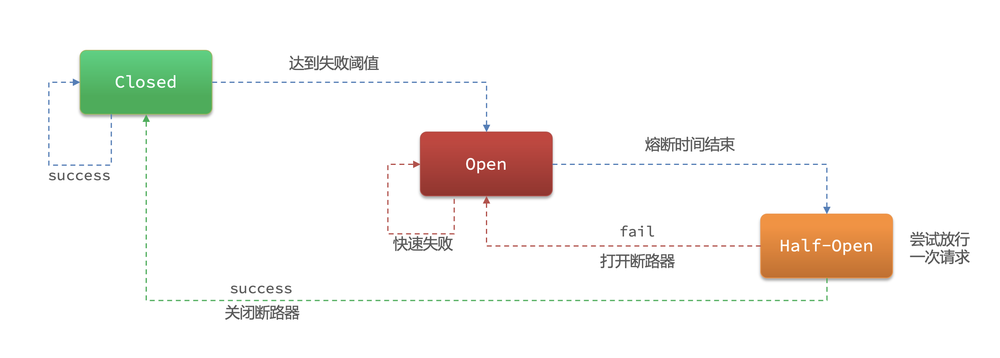
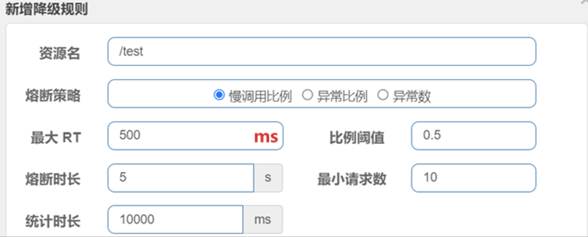

# SpringCloud
微服务单一职责

## 服务注册与配置文件 Nacos
`Nacos` 易于构建云原生应用的动态服务发现、配置管理和服务管理平台，[官方文档](https://nacos.io/docs/latest/overview/)

`docker-compose`安装`Nacos`，[详情](https://mp.weixin.qq.com/s/6WNddVrxNWMc55vOlLT5Ig)

```xml
<dependencies>
    <!--  nacos 服务发现  -->
    <dependency>
        <groupId>com.alibaba.cloud</groupId>
        <artifactId>spring-cloud-starter-alibaba-nacos-discovery</artifactId>
    </dependency>
    <!--  nacos 配置  -->
    <dependency>
        <groupId>com.alibaba.cloud</groupId>
        <artifactId>spring-cloud-starter-alibaba-nacos-config</artifactId>
    </dependency>
</dependencies>
```

## open-feign

主要用于服务间接口调用，优化了`RestTemplate`，主要依赖
```xml
<dependencies>
    <dependency>
        <groupId>org.springframework.cloud</groupId>
        <artifactId>spring-cloud-starter-openfeign</artifactId>
    </dependency>
</dependencies>
```

### 日志级别分类  

| 日志级别        | 说明                            |
|-------------|-------------------------------|
| **NONE**    | 不记录任何日志（默认值）。                 |
| **BASIC**   | 记录请求方法、URL、响应状态码以及执行时间。       |
| **HEADERS** | 在 `BASIC` 的基础上，额外记录请求和响应的头信息。 |
| **FULL**    | 记录请求和响应的所有细节，包括头信息、请求体和响应体。   |

#### 配置方法
需要打开日志级别，后续配置生效
```yaml
feign:
  client:
    config:
      default:
        logger-level: headers

logging:
  level:
    com.example: debug
```
**代码中设置日志级别**
```java
@Bean
Logger.Level feignLoggerLevel() {
    return Logger.Level.FULL; // 设置为 FULL，记录详细日志
}
```

### 优化
1. 设置较低的日志级别
2. 使用`feign-httpclient`  
    - 配置 HTTP 连接池  

```xml
<dependencies>
    <dependency>
        <groupId>io.github.openfeign</groupId>
        <artifactId>feign-httpclient</artifactId>
    </dependency>
</dependencies>
```
## 负载均衡 loadbalancer

`spring-cloud-starter-netflix-ribbon`和`spring-cloud-loadbalancer`都是`Spring Cloud`提供的负载均衡解决方案，但它们分别属于不同的项目和架构

| 特性            | `spring-cloud-starter-netflix-ribbon`     | `spring-cloud-loadbalancer`            |
|---------------|-------------------------------------------|----------------------------------------|
| **依赖框架**      | Netflix Ribbon                            | 基于 Spring Cloud 的反应式架构                 |
| **负载均衡策略**    | 提供多种策略：`RoundRobin`、`Random`、`Weighted` 等 | 提供基本策略：`RoundRobin`、`Random`，可扩展的策略    |
| **服务发现集成**    | 与 Eureka、Consul 集成                        | 与 Eureka、Consul、Nacos 等集成              |
| **负载均衡类型**    | 客户端负载均衡                                   | 客户端负载均衡                                |
| **是否支持反应式编程** | 不支持反应式编程                                  | 支持反应式编程（Spring WebFlux）                |
| **依赖性**       | 较重，包含 Ribbon 和相关的依赖                       | 轻量级，适合新型应用架构                           |
| **是否推荐**      | 不再推荐使用，已弃用                                | 推荐使用，适用于新版本 Spring Cloud 和 Spring Boot |
| **负载均衡行为**    | 负载均衡由客户端控制                                | 负载均衡由客户端控制，但与服务发现集成更加紧密                |

负载均衡选用`spring-cloud-loadbalancer`，相关依赖
```xml
<dependencies>
   <dependency>
       <groupId>org.springframework.cloud</groupId>
       <artifactId>spring-cloud-starter-loadbalancer</artifactId>
   </dependency>
</dependencies>
```
主要负载均衡策略有：  
- `NacosLoadBalancer` 与 Nacos 服务发现集成，通常在 Nacos 作为服务发现中心时使用，提供轮询的负载均衡方式
- `RandomLoadBalancer` 每次请求随机选择一个服务实例，适合负载较轻且需要一定随机性场景
- `RoundRobinLoadBalancer` 轮询的负载均衡方式，按照顺序依次选择服务实例，适合服务实例较均衡的情况

具体实践见`ProducerApplication`和`ConsumerApplication`两个应用程序

切换负载均衡策略，定义[LoadBalancerConfig](./ConsumerApplication/src/main/java/com/example/config/LoadBalancerConfig.java)
```java
@Configuration
public class LoadBalancerConfig {
    @Bean
    ReactorLoadBalancer<ServiceInstance> randomLoadBalancer(Environment environment,
                                                            LoadBalancerClientFactory loadBalancerClientFactory) {
        // String name = environment.getProperty("spring.application.name");
        String name = "producer-application";
        return new RandomLoadBalancer(loadBalancerClientFactory
                .getLazyProvider(name, ServiceInstanceListSupplier.class),
                name);
    }
}
```
启动类使用`@LoadBalancerClients(defaultConfiguration = LoadBalancerConfig.class)`注解标识负载均衡策略


## 网关 Gateway

[官方文档](https://docs.spring.io/spring-cloud-gateway/docs/4.0.6/reference/html/)

网关主要功能是作为微服务的入口，起到了防火墙的主要作用

网关的配置见[application.yaml](./Gateway/src/main/resources/application.yaml)


### predicates 断言

路由断言，判断请求是否符合要求，符合则转发到目标路由目的地，[详情](https://docs.spring.io/spring-cloud-gateway/docs/4.0.6/reference/html/#gateway-request-predicates-factories)

比较常见的：
- `The After Route Predicate Factory`配置一个时间，在此时间之后请求做转发
- `The Before Route Predicate Factory`配置一个时间，在此时间之后请求做转发
- `The Header Route Predicate Factory`请求必须要携带配置的请求头
- `The Path Route Predicate Factory`指定以什么路径开头的做转发

### filters 过滤器
网关提供了很多种[过滤器](https://docs.spring.io/spring-cloud-gateway/docs/4.0.6/reference/html/#gatewayfilter-factories)，最常见的过滤器`The StripPrefix GatewayFilter Factory`，切分请求路径。

过滤器分为模块过滤器、默认过滤器、全局过滤器，优先级依次。


## Alibaba Sentinel 服务保护
随着微服务的流行，服务和服务之间的稳定性变得越来越重要。[Sentinel](https://sentinelguard.io/zh-cn/docs/introduction.html) 是面向分布式、多语言异构化服务架构的流量治理组件，主要以流量为切入点，从流量路由、流量控制、流量整形、熔断降级、系统自适应过载保护、热点流量防护等多个维度来帮助开发者保障微服务的稳定性。
### 雪崩问题

微服务调用链路中的某个服务故障，引起整个链路中的所有微服务都不可用，这就是雪崩。

四种解决方案：
1. 超时处理：设定超市时间，请求超过一定时间没有响应就返回错误信息，不会无休止等待
2. 舱壁处理：线程隔离，限定每个业务能使用的线程数，避免耗尽整个系统资源
3. 熔断降级：由断路器统计业务执行的异常比例，如果超出阀值则会熔断该业务，拦截访问该业务的一切请求
4. 流量控制：限制业务访问的QPS，避免服务因流量的突增而故障

#### Sentinel VS Hystrix
|         | Sentinel          | Hystrix        |
|---------|-------------------|----------------|
| 隔离策略    | 信号量隔离             | 线程池隔离/信号量隔离    |
| 熔断降级策略  | 基于慢调用比例或异常比例      | 给予失败比率         |
| 实时指标实现  | 滑动窗口              | 滑动窗口（基于RxJava） |
| 规则配置    | 支持多种数据源           | 支持多种数据源        |
| 扩展性     | 多个扩展点             | 插件形式           |
| 基于注解的支持 | 支持                | 支持             |
| 限流      | 基于QPS，支持基于调用关系的限流 | 有限的支持          |
| 流量整形    | 支持慢启动、匀速排队模式      | 不支持            |
| 系统自适应保护 | 支持                | 不支持            |
| 控制台     | 开箱即用，可配置规则，查看秒级监控 | 不完善            |

### Sentinel Dashboard 流量控制

[下载地址](https://github.com/alibaba/Sentinel/releases)，启动命令如下
```shell
java -Dserver.port=8080 -Dcsp.sentinel.dashboard.server=localhost:8080 -Dproject.name=sentinel-dashboard -jar sentinel-dashboard.jar
```

#### 簇点链路
簇点链路：是项目内的**调用链路**，链路中被监控的**每个接口**就是一个资源。默认情况下sentinel会监控SpringMVC的每一个端点（Endpoint），因此SpringMVC的每一个端点（Endpoint）就是调用链路中的一个资源。**流控、熔断**等都是针对**簇点链路**中的资源来设置的

#### 流控访问
限制业务访问的QPS

##### 流控模式
1. 直接：统计当前资源的请求，触发阈值时对当前资源直接限流，也是默认的模式
2. 关联：统计与当前资源相关的另一个资源，触发阈值时，对当前资源限流，优先级高的可以执行，优先级较低的被限流 
3. 链路：统计从指定链路访问到本资源的请求，触发阈值时，对指定链路限流，多个线程请求一个资源，对资源进行监控，对请求源限流

##### 流控效果
1. 快速失败：QPS超过阈值时，拒绝新的请求
2. Warm-up(预热模式)： QPS超过阈值时，拒绝新的请求；QPS阈值是逐渐提升的，可以避免冷启动时高并发导致服务宕机。
3. 排队等待：请求会进入队列，按照阈值允许的时间间隔依次执行请求；如果请求预期等待时长大于超时时间，直接拒绝

##### 热点参数限流

通过`@SentinelResource("hot")`设置热点资源名，然后对热点资源的请求参数进行限流配置

### 线程隔离和熔断降级

线程隔离是指在对其他服务调用是，对调用的线程进行隔离，限制线程数  

熔断降级，在调用服务时统计故障比率，到达阈值后直接失败

线程隔离和熔断降级都是对**调用者的保护**


#### 线程隔离

线程隔离分为两类：
1. 线程池隔离，对每一个服务分配固定的线程数量  
   - 优点：支持主动超时，支持异步调用
   - 缺点：线程的额外开销比较大
   - 场景：低扇出
2. 信号量隔离，分配总信号量，限制最终的线程数数量。
   - 优点：轻量级，无额外开销
   - 缺点：不支持主动超时，不支持异步调用
   - 场景：高频调用，高扇出

线程隔离截图

### 熔断降级
主要思路是由**断路器**统计服务调用的异常比例、慢请求比例，如果超出阈值则会熔断该服务。即拦截访问该服务的一切请求；而当服务恢复时，断路器会放行访问该服务的请求。

断路器是根据状态机实现的，三种状态
1. Closed 断路器关闭，放开请求
2. Open 断路器打开，拒绝请求
3. Half-Open 尝试放行，统计成功数  


#### 熔断策略

三种策略：慢调用、异常比例、异常数

##### 慢调用

业务的响应时长 Response Time（RT）大于指定时长的请求认定为慢调用请求。在指定时间内，如果请求数量超过设定的最小数量，慢调用比例大于设定的阈值，则触发熔断



解读：RT超过500ms的调用是慢调用，统计最近10000ms内的请求，如果请求量超过10次，并且慢调用比例不低于0.5，则触发熔断，熔断时长为5秒。然后进入half-open状态，放行一次请求做测试

#### 异常比例

异常比例或异常数：统计指定时间内的调用，如果调用次数超过指定请求数，并且出现异常的比例达到设定的比例阈值（或超过指定异常数），则触发熔断

### 授权规则
授权规则可以对调用方的来源做控制，有白名单和黑名单两种方式  

1. 白名单：来源（origin）在白名单内的调用者允许访问
2. 黑名单：来源（origin）在黑名单内的调用者不允许访问

截图

```java
@Component
public class HeaderOriginParser implements RequestOriginParser {

   /**
    * 返回应用名称
    * @return 应用名称
    */
   @Override
   public String parseOrigin(HttpServletRequest httpServletRequest) {
      String origin = httpServletRequest.getHeader("origin");
      if (StringUtils.isEmpty(origin)) {
         origin = "blank";
      }
      return origin;
   }
}
```

自定义异常结果，见[SentinelBlockHandler.java](./AliSentinel/src/main/java/com/example/sentinel/SentinelBlockHandler.java)


### 规则持久化

#### 规则管理模式

1. 原始模式，API将规则推送至客户端并直接更新到内存中，扩展写数据源(WritableDataSource)，默认这种  
   - 优点：简单，无依赖
   - 缺点：不保证一致性；规则保存在内存中，重启即消失
2. Pull模式，扩展数据源(WritableDataSource)，客户端主动向某个规则管理中心定期轮训拉取规则，这个规则中心可以是RDBMS、文件等
   - 优点：简单，无任何依赖，规则持久化
   - 缺点：不保证一致性；实时行不保证，拉取过于频繁也可能会有性能问题
3. Push模式，规则中心统一推送，客户端通过注册监听器的方式时刻监听变化，比如使用Nacos、Zookeeper等配置中心。**生产环境一般采用push模式的数据源**
   - 优点：规则持久化，一致性
   - 缺点：引入第三方依赖

#### Push模式 持久化

##### 修改应用服务
1. 添加依赖

   ```xml
   <dependency>
       <groupId>com.alibaba.csp</groupId>
       <artifactId>sentinel-datasource-nacos</artifactId>
   </dependency>
   ```

2. 配置nacos地址

   ```yaml
   spring:
     cloud:
       sentinel:
         datasource:
           flow:
             nacos:
               server-addr: localhost:8848 # nacos地址
               dataId: sentinel-flow-rules
               groupId: SENTINEL_GROUP
               rule-type: flow # 还可以是：degrade、authority、param-flow
   ```

##### 修改Sentinel Dashboard
todo