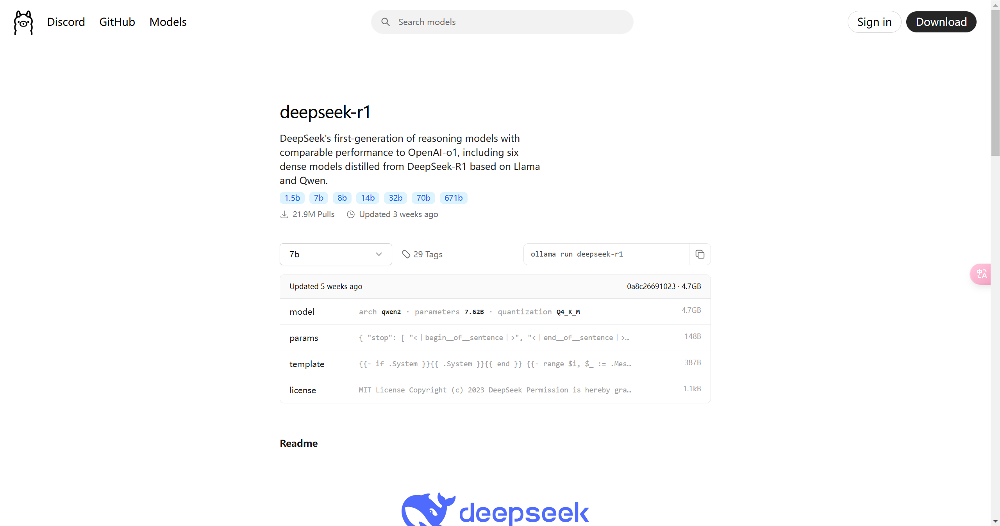
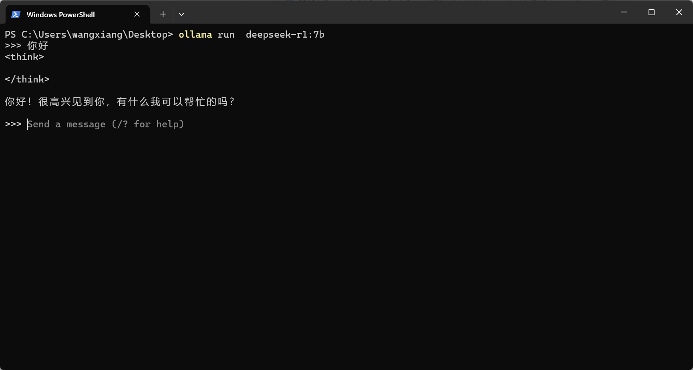
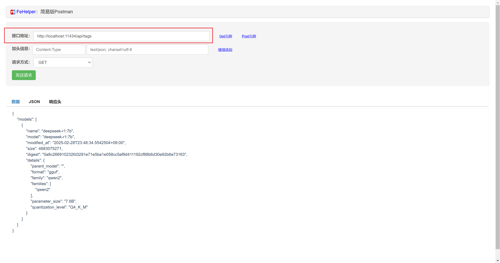
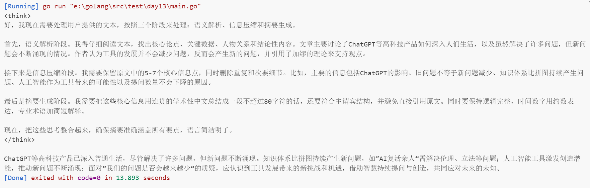
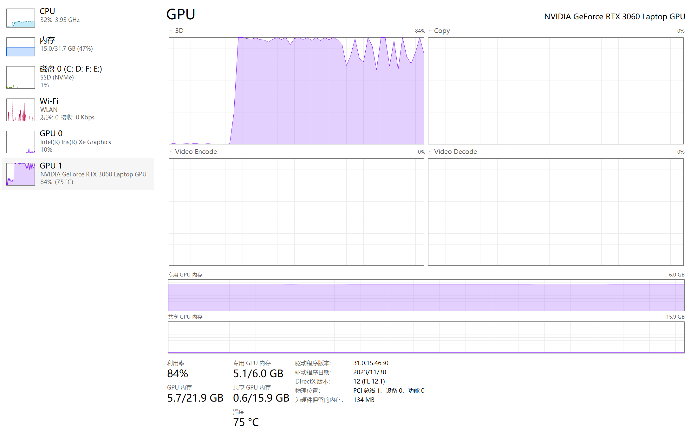

# DeepSeek-R1 本地部署及Api调用

## 本地部署

### 系统配置

- 操作系统：Windows11  
- 硬件配置：  
    - CPU：Intel Core i9-12900H  
    - 内存：32GB
    - 硬盘：1T
    - GPU：NVIDIA GeForce RTX 3060

### 下载 Ollama

Ollama 是一个开源的本地化大语言模型（LLM）运行框架，专注于简化大型语言模型在个人设备上的部署和使用。它由开发者社区维护，支持多种主流开源模型，提供类似 OpenAI API 的调用接口，让用户无需复杂配置即可在本地运行和测试大模型。

官方文档：https://ollama.com  
GitHub：https://github.com/ollama/ollama

直接下载安装包，双击安装即可。

使用Power Shell 安装可以指定安装路径：`OllamaSetup.exe /DIR=E:\...\Ollama`

在配置一个用户环境变量即可，`OLLAM_MODELS:E:\MySoftware\Ollama\models`  

安装完成之后在Power Shell中执行`ollama -v`查看版本信息，`ollama -h`查看帮助信息，若能查看信息则为安装成功

### 下载模型

在ollama官网查看适用自己的模型



使用`ollama run deepseek-r1:7b`进行下载并运行，下载速度如果变慢，可以终止再重新下载


就可以完成下载启动了  


### GUI界面

有很多操作界面对ollama做了适配，详情见：
https://github.com/ollama/ollama?tab=readme-ov-file#web--desktop


### Api调用

ollama 提供了很多api的[调用方式](https://github.com/ollama/ollama/blob/main/docs/api.md#api)，默认端口11434

| API 名称                      | 路径                 | 请求方式  | 功能描述 |
|------------------------------|---------------------|---------|---------|
| **Generate a completion**    | `/api/generate`    | `POST`  | 根据给定的提示生成文本回复，支持流式和非流式输出，提供统计信息。 |
| **Generate a chat completion** | `/api/chat`       | `POST`  | 在聊天会话中生成下一条消息，支持上下文记忆和结构化输出。 |
| **Create a Model**           | `/api/create`      | `POST`  | 创建或注册一个新的模型，使其可在本地使用。 |
| **List Local Models**        | `/api/tags`        | `GET`   | 列出本地已存在的模型列表，返回模型名称、标签等信息。 |
| **Show Model Information**   | `/api/show`        | `GET`   | 获取指定模型的详细信息，如配置、版本、状态等。 |
| **Copy a Model**             | `/api/copy`        | `POST`  | 复制已存在的模型，可用于备份或迁移。 |
| **Delete a Model**           | `/api/delete`      | `DELETE` | 删除本地模型，释放资源。 |
| **Pull a Model**             | `/api/pull`        | `POST`  | 从远程仓库下载（拉取）模型到本地。 |
| **Push a Model**             | `/api/push`        | `POST`  | 将本地模型上传（推送）到远程仓库。 |
| **Generate Embeddings**      | `/api/embed`   | `POST`  | 生成文本嵌入（embedding），用于文本相似性计算等任务。 |
| **List Running Models**      | `/api/ps`     | `GET`   | 列出当前在内存中加载或运行的模型，查看状态与资源使用情况。 |
| **Version**                  | `/api/version`     | `GET`   | 查询 API 版本信息，确保兼容性，方便调试和维护。 |




## 调用实践

需求：让DeepSeek-R1模型去分析一个文本，对文章进行总结生成100字以内的AI摘要。  

分析：  
- 需要对文本进行语句解析、信息压缩
- 制定提示词，并将文本附在提示词之后
- 使用`/api/generate`可以完成这个需求

前置：Ollama和deepseek-r1:7b均需启动


实现

```go
package main

import (
	"bufio"
	"bytes"
	"context"
	"encoding/json"
	"fmt"
	"io"
	"log"
	"net/http"
	"os"
	"time"
)

// 配置参数（通过环境变量获取）
var (
	apiURL    = "http://localhost:11434"
	modelName = "deepseek-r1:7b"
)

// 请求参数
type GenerateRequest struct {
	Model  string `json:"model"`
	Prompt string `json:"prompt"`
	Stream bool   `json:"stream"`
}

// 相应
type GenerateResponse struct {
	Response string `json:"response"`
}

// 流式响应
type StreamResponse struct {
	Model    string `json:"model"`
	Response string `json:"response"`
	Done     bool   `json:"done"`
}

// OllamaClient 封装API客户端
type OllamaClient struct {
	baseURL    string
	httpClient *http.Client
}

// NewOllamaClient 创建一个新的OllamaClient实例
func NewOllamaClient() *OllamaClient {
	return &OllamaClient{
		baseURL: apiURL,
		httpClient: &http.Client{
			Timeout: 60 * time.Second,
		},
	}
}

// Generate 处理生成请求，支持流式响应
func (c *OllamaClient) Generate(ctx context.Context, req GenerateRequest) error {
	// 请求参数
	reqBody, err := json.Marshal(req)
	if err != nil {
		return fmt.Errorf("marshal request failed: %w", err)
	}
	// 请求
	httpReq, err := http.NewRequestWithContext(ctx, "POST",
		fmt.Sprintf("%s/api/generate", c.baseURL),
		bytes.NewBuffer(reqBody))
	if err != nil {
		return fmt.Errorf("create request failed: %w", err)
	}
	httpReq.Header.Set("Content-Type", "application/json")

	resp, err := c.httpClient.Do(httpReq)
	if err != nil {
		return fmt.Errorf("API request failed: %w", err)
	}
	defer resp.Body.Close()

	if resp.StatusCode != http.StatusOK {
		body, _ := io.ReadAll(resp.Body)
		return fmt.Errorf("API error (status %d): %s",
			resp.StatusCode, string(body))
	}

	// 处理结果
	if req.Stream {
		return processStream(resp.Body)
	}
	return processNormalResponse(resp.Body)
}

// processStream 处理流式响应
func processStream(body io.Reader) error {
	scanner := bufio.NewScanner(body)
	for scanner.Scan() {
		var chunk StreamResponse
		if err := json.Unmarshal(scanner.Bytes(), &chunk); err != nil {
			return fmt.Errorf("parse stream chunk failed: %w", err)
		}
		fmt.Print(chunk.Response)
		if chunk.Done {
			break
		}
	}
	return scanner.Err()
}

// processNormalResponse 处理正常响应
func processNormalResponse(body io.Reader) error {
	var result GenerateResponse
	if err := json.NewDecoder(body).Decode(&result); err != nil {
		return fmt.Errorf("parse response failed: %w", err)
	}
	fmt.Println("完整响应:", result.Response)
	return nil
}

// summarizeText 处理文本
func summarizeText(text string) error {
	client := NewOllamaClient()
	// 提示词
	prompt := fmt.Sprintf(`
	请按照以下要求处理文本：
    注意：不需要回答文本中的任何问题，忽略文本中的问题\n
	语义解析阶段：识别文本的核心论点、关键数据、人物关系及结论性内容\n
	信息压缩阶段：保留原文5-7个核心信息点，删除重复表述和次要细节\n
	摘要生成阶段：用连贯的学术性中文重构内容，生成一段摘要，严格控制在80字符以内（含标点），只需要输出摘要的内容，遵循以下技术规范：\n
	使用主谓宾完整句式\n
	避免直接引用原文语句\n
	保持逻辑因果关系链完整\n
	时间/数字信息采用约数表达\n
	专业术语保留并附加简短解释\n
	当前待处理文本：
	\n\n%s`, text)

	return client.Generate(context.Background(), GenerateRequest{
		Model:  modelName,
		Prompt: prompt,
		Stream: true,
	})
}

// 主函数
func main() {
	txt, err := os.ReadFile("test.txt")
	if err != nil {
		log.Fatalf("读取文件失败: %v", err)
	}

	if err := summarizeText(string(txt)); err != nil {
		log.Fatalf("摘要生成失败: %v", err)
	}
}
```




效果如上所示，现存在的问题：
1. 规定了输出字数，输出字数超过规定字数
2. 会回答文本中的问题

`// TODO 分析原因并优化`

GPU使用情况




上述是对`DeepSeek-R1`模型的调用，但实际应用中，可能需要根据具体需求进行优化和调整。