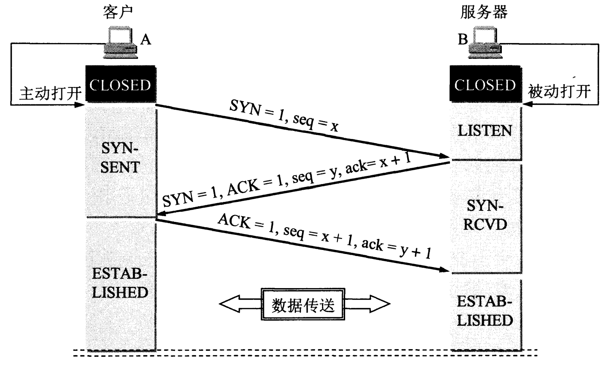
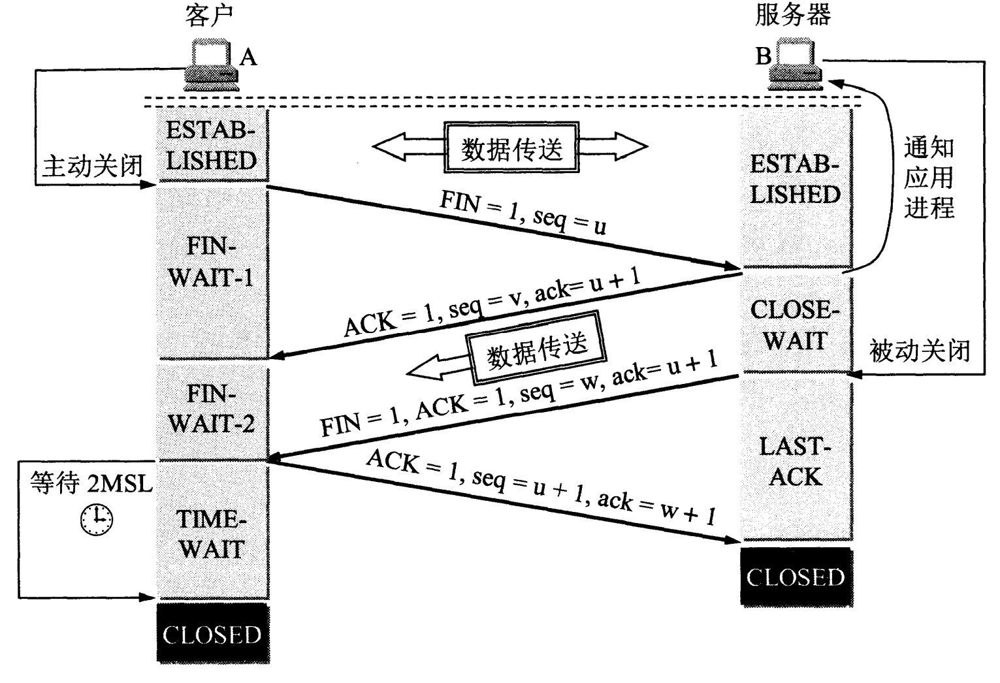

### 计算机网络

1. [七大模型](#七大模型)
2. [传输层](#传输层-tcp-vs-udp)
3. [TCP三次握手](#tcp三次握手three-way-handshake)
4. [TCP四次挥手](#什么是四次挥手)

#### 七大模型

1. 物理层

- 功能：数据在物理介质上的传输
- 技术：以太网、电缆

2. 数据链路层

- 功能：在物理层的基础上提供可靠的数据传输。帧的封装、错误检测与纠正、流量控制
- 协议：ppp(点对点协议)、MAC地址

3. 网络层

- 功能：负责在不同的网络之间传输数据包，处理数据的路由选择。通过IP地址实现跨网络的数据传输
- 协议：IP、路由协议（RIP、OSPF）、ICMP

4. 传输层

- 功能：负责端到端的通信，确保数据的可靠性
- 协议：TCP、UDP

5. 会话层

- 功能：负责建立、管理和终止会话，确保数据交换的顺序和同步
- 协议：RPC

6. 表示层

- 功能：负责数据的格式化、加密和解密。确保数据的语法和语义能够被发送和接收的双方正确理解
- 协议：SSL/TSL

7. 应用层

- 功能：直接与用户或应用程序交互，提供网络服务。处理与网络应用程序相关的所有事务
- 协议：HTTP、FTP、DNS、POP3

#### 传输层 TCP VS UDP

- TCP 是一种面向连接的协议，提供可靠、顺序的字节流传输。通过三次握手建立连接，保证数据传输的可靠性，并通过四次回收断开连接。TCP提供流量控制、拥塞控制
- UDP 是一种无连接的协议，提供不可靠的字节流服务。UDP协议不进行流量控制，也不保证数据的顺序和可靠到达

主要区别：

| 特性   |              TCP              |             UDP             |
|:-----|:-----------------------------:|:---------------------------:|
| 连接方式 |         面向连接（需要建立连接）          |         无连接（直接发送数据）         |
| 可靠性  |            提供可靠的传输            |           不提供可靠性            |
| 顺序保证 |            保证数据顺序             |           不保证数据顺序           |
| 流量控制 |            提供流量控制             |           不提供流量控制           |
| 拥塞控制 |            提供拥塞控制             |           不提供拥塞控制           |
| 开销   |              较高               |             较低              |
| 适用场景 | 对可靠性要求高的应用 文件传输、电子邮件、网页浏览 | 对延时要求高的应用 视频会议、实时游戏、直播  |

#### TCP三次握手（three-way handshake）

- 第一次握手：Client将SYN设置为1，随机生成一个序列号seq发送给Server，进入SYN_SENT状态；
- 第二次握手：Server收到Client的SYN=1之后，知道客户端请求建立连接，将SYN设置1，ACK(确认连接信号)置为1，产生一个 ack(acknowledge) = seq + 1,并随机生成一个Server的序列号，一并发给Client，进入SYN_RCVD状态；
- 第三次握手：Client检查ack(acknowledge)是否为第一次握手的随机序列号+1，检查ACK是否为1，检查通过只好，设置ACK(确认连接)，设置ack(acknowledge)=Server seq + 1，一并发送给Server，Server检查seq是不是为第二次握手seq+1；完成三次握手，连接建立。

#### TCP建立连接可以两次握手
- **可能“半连接”，浪费资源**，客户端发送了一个 SYN 请求，服务器响应了 SYN-ACK，但客户端未确认此连接，服务器可能白白浪费资源维持“半连接”状态
- **旧报文引发错误连接**，旧的 SYN 报文可能被服务器当作新的连接，导致意外的连接建立，通信出错

#### 什么是四次挥手

- 第一次挥手，Client将FIN设置为1和一个序列号seq发送给Server，进入FIN-WAIT-1状态
- 第二次挥手，Server收到FIN之后，发送一个ACK=1，ack(acknowledge)=Client seq + 1，进入CLOSE-WAIT状态。此时客户端已经没有要发送的数据了，但可以接受服务器发来的数据
- 第三次挥手，Server将FIN设置为1，生成随机seq，ack(acknowledge)=Client seq + 1，发送一个序列号给Client；进入LAST_ACK状态
- 第四次挥手，Client收到Server FIN = 1 后，判断ack之后，将ACK设置为1，seq = Client seq + 1，ack = Server seq + 1，发送至服务端；服务端收到后，校验ack之后，状态转为CLOSED，不再向客户端发送数据。客户端等待2 * MSL（报文最长寿命）后，也进入CLOSED状态。完成四次挥手