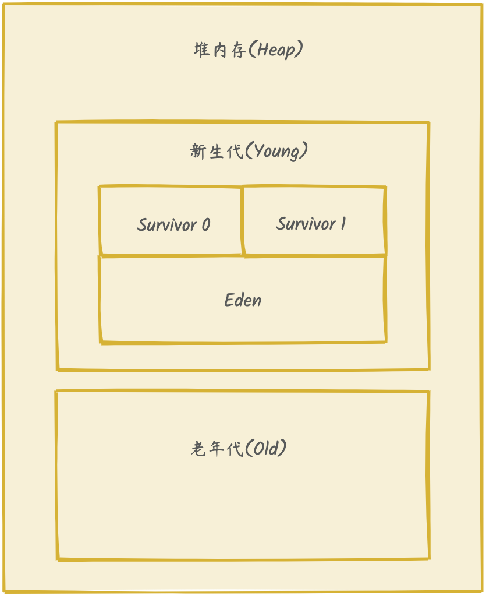
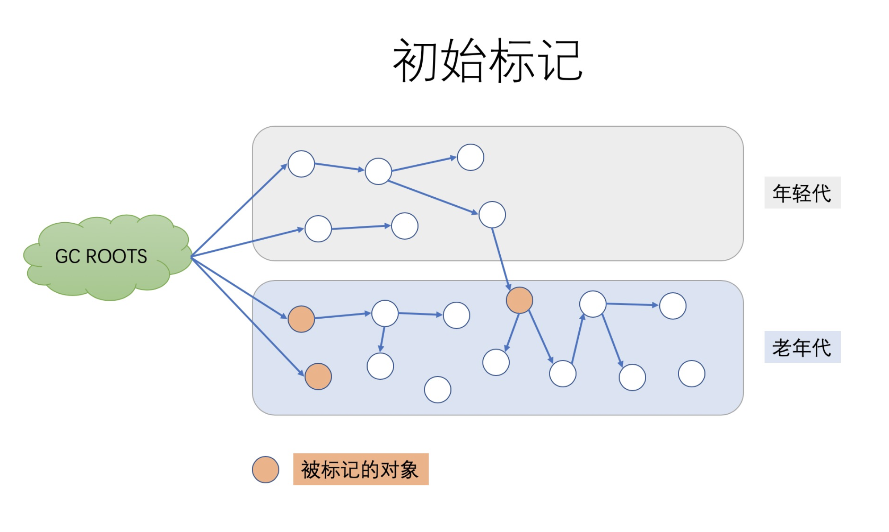

# Java

## 类加载

## 类加载机制

## 内存结构

JVM（Java虚拟机）的内存结构是其运行时数据区域的核心组成部分，用于管理程序执行过程中的内存分配和回收

### 程序计数器

#### 作用
记录当前线程执行的位置（字节码指令地址）

#### 特性
1. **线程私有**，每个线程独立存储  
2. 唯一不会发生 OutOfMemoryError 的区域  

### 虚拟机栈

#### 作用
存储方法调用栈帧（每个方法对应一个栈帧），管理局部变量、操作数栈、动态链接和方法返回地址

#### 栈帧结构
- 局部变量表：存放方法参数和方法内定义的局部变量（基本类型和对象引用）
- 操作数栈：执行自己饿吗指令的临时操作数存储区
- 动态链接：指向运行时常量池中该方法的符号引用
- 返回地址：方法退出后需要返回的位置

#### 特点
1. **线程私有**
2. 可能抛出的异常
   - `StackOverflowError`：栈深度超过限制（无限递归）
   - `OutOfMemoryError`：扩展栈是无法申请足够内存

### 本地方法栈

#### 作用
为Native方法提供服务

#### 特性
**线程私有**

### 方法区
#### 作用
存储类信息、常量、静态变量、即时编译器编译后的代码，包含运行时常量池，存放编译期生成的字面量、符号引用及运行时添加的常量

#### 特性
1. **线程共享**
2. 可能抛出`OutOfMemoryError`

### 堆

堆是Java应用程序最重要的一个内存结构

#### 作用
存放所有对象实例和数组（通过 new 关键字创建的对象）

#### 特性
1. **线程共享**
2. 可能抛出`OutOfMemoryError`
3. 通过 `-Xmx` 和 `-Xms` 设置最大和初始堆大小，最好是设置一致

#### 堆内存划分

1. 新生代  
    - Eden区：对象初次分配的区域
    - Survivor区：存放经过Minor GC后存活的对象
2. 老年代：存放长期存活的对象（经过多次GC未被回收）

## GC(Garbage Collection)垃圾回收

什么是垃圾收集器？

垃圾收集器 (GC) 自动管理应用程序的动态内存分配请求。[官网](https://docs.oracle.com/en/java/javase/11/gctuning/introduction-garbage-collection-tuning.html#GUID-326EB4CF-8C8C-4267-8355-21AB04F0D304)解释的非常详细。

### 垃圾回收算法

1. 标记-清除，将存活的对象进行标记，清理掉未被标记的对象；不足会缠身大量不连续的内存碎片
2. 标记-整理，让所有存活的对象向一端移动，然后直接清理掉端边界以外的内存
3. 复制，将内存划分为大小相等的两块，每次当一块的内存使用完了就讲存活的对象复制到另一块并整理
4. 分代收集
    a. 新生代：复制算法  
  b. 老年代：标记-清除 或者 标记-整理 算法

### 堆内存分配

1. 新生代(Young Generation)
   
    新生代主要存储新创建的对象，新生代分为三个部分：

    - Eden(伊甸区):大部分新对象分配的地方
    - Survivor 0(幸存区0)：第一次垃圾回收后，Eden区中存活的对象会被复制到 Survivor 0
    - Survivor 1(幸存区1)：第二次及以后的GC，Survivor 0中存活的对象会被复制到Survivor 1，两个区互相替换

    特点：
    
    - 短生命周期对象在新生代巨多(如局部变量)
    - Eden : Survivor 0 : Survivor 1 = 8 : 1 : 1， 通过`-XX:SurvivorRatio`设置
    - 每经历一次GC，对象年龄+1，年龄达到升级阀值后升为老年代

2. 老年代(Old Generation)

    老年代主要存储生命周期较长的对象，通常是新生代经过多次GC之后年龄超过限定会升到老年代

    特点：

    - 生命周期较长的大对象
    - 较少发生GC，但GC耗时较长
    - 新生代对象经过多次GC晋升到老年代
    - 老年代 : 新生代 = 2 : 1，可以通过`-XX:NewRatio`设置

3. 元空间(Metaspace)

    元空间是JDK 8之后替代永久代（PermGen）的区域，用于存储类的元信息（类的结构、方法等）

    特点：
    - 不在堆内存中，而是在本地内存（Native Memory）
    - 动态扩展，避免了永久代的内存溢出问题

堆内存分区图例

### Concurrent Mark Sweep（CMS）

1. 工作原理

    CMS是一种基于`标记-清除`算法的收集器，其核心思想是尽可能避免长时间的全停顿，垃圾回收过程分为以下几个阶段：

    - 初始标记(Initial Mark)，标记GC Roots直接关联的对象，会出现STW(stop-the-world，暂停程序)

    

    - 并发标记(Concurrent Mark)，从初始阶段标记的对象出发，递归扫描可达对象，**不造成停顿**
    - 重新标记，修正并发标记时，标记遗漏问题，停顿时间短
    - 并发清理，清理标记阶段未标记的不可达对象，回收内存，不会造成停顿

2. 触发条件

    - 老年代的空间达到一定比例(默认92%)时，CMS会被触发,`-XX:CMSInitiatingOccupancyFraction=<N>`N为占用百分比
    - 堆空间不足，会执行Full GC，导致全部停顿

3. 优缺点

    - 优点，停顿时间短，并发执行
    - 缺点，内存空间碎片化，Full GC风险高

从 JDK 9 开始，CMS 收集器已被弃用

### Garbage First（G1）

G1 是一种基于`标记整理`算法的收集器，它是Java 9之后推荐的默认垃圾收集器，它将堆划分为**多个区域**，每个区域大小在1MB到32MB不等，并且必须是2的幂，[官方文档](https://www.oracle.com/technetwork/tutorials/tutorials-1876574.html)

1. 工作原理

    - 初始标记(Initial Mark)，标记GC Roots及其直接引用的对象，会出现STW
    - 并发标记(Concurrent Mark)，从初始化标记开始递归标记整个堆可达对象
    - 重新标记(Remark)，修正标记结果，会出现STW(stop-the-world，暂停程序)，比CMS快
    - 清理(Clean up)，重新计算每个区域的存活率，并决定哪些区域应该在下一轮混合GC中被清理，重置空闲区域
    - 复制(Copying)，将存活对象从旧的Region中复制到新的Region，以清理和压缩堆内存，有STW

2. 触发条件

    - 堆内存到达内存阀值
    - 周期性GC

3. 优缺点

    - 优点：G1能够配置的最大停顿时间`-XX:MaxGCPauseMillis`，保证每次GC的停顿时间不会超过最大值，适合大堆内存的场景
    - 缺点：调优参数比较复杂，CPU开销较高

### Z Garbage Collector（ZGC）

Z Garbage Collector (ZGC) 是 Oracle JDK 从版本 11 开始引入的一种低延迟垃圾收集器，特别设计用于处理大堆（Terabytes级别的堆大小），并且旨在将停顿时间保持在10毫秒以内

1. 工作原理

    -  初始标记(Initial Mark)，初始标记阶段的主要任务是标记 GC Root 对象，应用线程会被暂停
    -  并发标记(Concurrent Mark)，从初始化标记开始递归标记整个堆可达对象
    -  重新标记(Remark)，修正标记结果，会出现STW，比CMS快
    -  并发清理(Concurrent Cleanup)，并发清理堆中未标记的对象，释放不再使用的内存并清理空闲区域
    -  并发整理(Concurrent Relocation)，整理并压缩堆内存，减少内存碎片
    -  复制(Copying)，标记为存活的对象从 旧的内存区域 复制到 新的内存区域

2. 触发条件

    - 年轻代满，会出发GC
    - 堆内存到达内存阀值
    - Full GC

3. 优缺点

    - 优点，停顿时间短，并发清理内存和整理空间，适用于大堆内存
    - 缺点，不够成熟，需要更多的实验

### Java 后续版本 新GC

1. ZGC，Java 11提出，Java 15正式引入
2. JEP 389 - ZGC，提供可配置的停顿时间，Java 16 引入
3. G1 后续不断优化

## 源码学习

