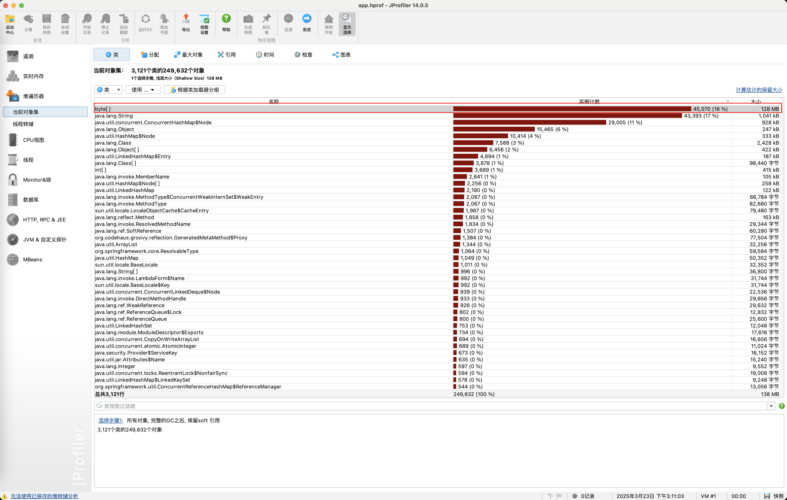

### 内存泄漏

```java
private static List<byte[]> leakList = new ArrayList<>();

@GetMapping("/memory/leak")
public void test2() {
    try {
        while (true) {
            // 分配1MB的内存块
            byte[] block = new byte[1024 * 1024];
            leakList.add(block);

            // 每隔100毫秒分配一次，模拟内存不断积累
            Thread.sleep(100);
        }
    } catch (Exception e) {
        e.printStackTrace();
    }
}
```

```shell
java -jar -Xms256m -Xmx256m -XX:+HeapDumpOnOutOfMemoryError -XX:HeapDumpPath=/Users/wx/workspace/app.hprof test.jar


jstat -gcutil <pid> 1000  # 观察Old区使用率持续上涨
```
`-XX:+HeapDumpOnOutOfMemoryError`: 在发生 OutOfMemoryError 时自动生成堆转储文件（Heap Dump）
`-XX:HeapDumpPath`: 指定堆转储文件的保存位置，可以使用工具（如 MAT、JProfiler 等）打开和分析


可以通过`jmap`命令生成`hprof`报告
```shell
jmap -dump:live,format=b,file=heap_dump.bin <pid>

# 查看Java进程
jps -l
jcmd
ps -ef | grep java
```


使用`JProfiler`打开`*.hprof`文件，查看最大内存占有的数据类型



点击目标数据类型，选择`incoming references`

- `incoming references`：查看目标数据类型被哪些对象引用了
- `outgoing references`：查看目标数据类型引用了哪些对象


找到泄漏对象 `LeakedObject`由于被静态集合引用而无法被垃圾回收，从而确定位置


### CPU飙升

```java
@GetMapping("/cpu")
public void test3() {
    CompletableFuture<Void> t1 = CompletableFuture.supplyAsync(() -> {
            while (true) {
                // 密集计算，无退出条件
                double result = 0;
                for (int i = 0; i < 100000; i++) {
                    result += Math.sqrt(i) * Math.tan(i);
                }
            }
        }, threadPoolExecutor);

        CompletableFuture<Void> t2 = CompletableFuture.supplyAsync(() -> {
            while (true) {
                try {
                    Thread.sleep(1000);
                    System.out.println("正常业务运行中...");
                } catch (InterruptedException e) {
                    e.printStackTrace();
                }
            }
        }, threadPoolExecutor);
        CompletableFuture.allOf(t1, t2).join();
}
```

1. 定位Java进程，`top -c`
2. 查看线程级别CPU占用，`top -Hp <PID>`
3. 抓去线程快照，`jstack <PID> > thread.txt`
4. 线程ID转换`printf "%x\n" <线程ID> `
5. 进行分析
```txt
"WXW-Thread-1" #35 daemon prio=5 os_prio=31 cpu=150071.37ms elapsed=150.75s tid=0x00007fdfb58fea00 nid=0x7207 runnable  [0x0000700006795000]
   java.lang.Thread.State: RUNNABLE
	at com.example.controller.TestThreadController.lambda$test3$2(TestThreadController.java:94)
	at java.util.concurrent.CompletableFuture$AsyncSupply.run(java.base@17.0.13/CompletableFuture.java:1768)
	at java.util.concurrent.ThreadPoolExecutor.runWorker(java.base@17.0.13/ThreadPoolExecutor.java:1136)
	at java.util.concurrent.ThreadPoolExecutor$Worker.run(java.base@17.0.13/ThreadPoolExecutor.java:635)
	at java.lang.Thread.run(java.base@17.0.13/Thread.java:840)
```
通过日志查找问题所在


使用JProfiler分析CPU视图，定位异常线程和代码
