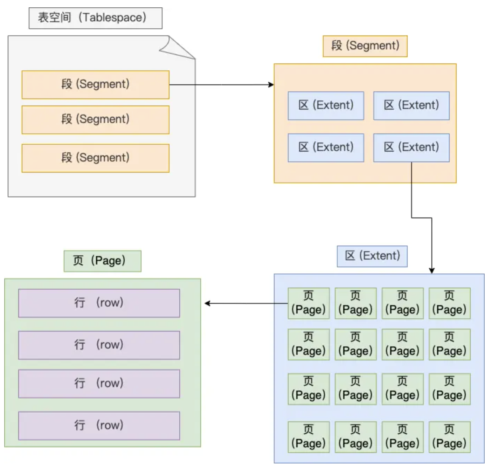

### MySQL

Docker 安装 MySQL8.0，安装见[docker-compose.yaml](./singleton/docker-compose.yaml)

#### 操作类型

SQL 程序语言有四种类型，对数据库的基本操作都属于这四种类，分为 DDL、DML、DQL、DCL

1. DDL(Dara Definition Language 数据定义语言)，是负责数据结构定义与数据对象定义的语言，由 create、alter、drop、truncate 四个语法组成

    - create table 创建表
    - alter table 修改表
    - drop table 删除表
    - truncate table 清空表

2. DML(Data Manipulation Language 数据操纵语言)，主要是进行插入数据、修改数据、删除数据的操作，由 insert、update、delete 语法组成
3. DQL(Data Query Language 数据查询语言)，用来进行数据库中的数据查询，最常用的就是 select 语句
4. DCL(Data Control Language 数据控制语言)，用来授权或回收访问数据库的某种特权，并控制数据库操纵事务发生的时间及效果，能够对数据库进行监视

#### 存储过程

MySQL数据存储位置可以通过`SHOW VARIABLES LIKE 'datadir';`去获取，每一个数据库都会有一个文件，每一张表都会有一个*.ibd文件，这个文件存储着表数据、索引、UNDO日志等等..

##### 表空间文件结构

表空间有文件头(File Header)、段(Segment)、区(Extent)、页(Page)

1. 段(Segment)，段是表空间的逻辑分区，用于管理不同类型的数据，如表的**数据段**、**索引段**、溢出段等
2. 区(Extent)，每个区由多个连续的页组成，默认大小为 1MB（即 64 个连续的 16KB 页）
3. 页(Page)，页是 InnoDB 表空间文件的基本存储单元，每页存储不同的数据内容，如行数据、索引、回滚信息等
4. 行(Row)，行是表中数据的基本逻辑单位，代表每一条记录；记录以特定格式存储在数据页中，并包含实际的列值、元信息（如事务 ID、回滚指针等）



##### 数据页结构

数据库I/O操作的最小单位是页，与数据库相关的内容都会存储在页结构里。数据页包括七个部分，分别是文件头（File Header）、页头（Page Header）、最大最小记录（Infimum+supremum）、用户记录（User Records）、空闲空间（Free Space）、页目录（Page Directory）和文件尾（File Tailer）


##### 行(Row)格式分类

MySQL 支持以下几种行格式，具体格式由表的 ROW_FORMAT 定义：Compact（紧凑格式）、Redundant（冗余格式，MySQL 早期版本的默认格式）、Dynamic（动态格式）、Compressed（压缩格式）

```sql
CREATE TABLE example (
    id INT,
    name VARCHAR(255)
) ENGINE=InnoDB ROW_FORMAT=COMPACT;
```

以Compact为例

| 字段   | 内容                   | 说明            |
|------|----------------------|---------------|
| 行头信息 | INFO_BITS, HEAP_NO 等 | 用于管理行的元信息     |
| 隐藏列  | TRX_ID, ROLL_PTR 等   | 用于支持事务和回滚     |
| 用户数据 | id=1                 | 定长数据直接存储      |
| 用户数据 | name='Alice'         | 包括长度前缀和实际数据   |
| 用户数据 | age=30               | 定长数据直接存储      |
| 用户数据 | bio 指向溢出页            | 如果数据过大，存储在溢出页 |

#### 存储引擎

可以通过`SELECT * FROM INFORMATION_SCHEMA.ENGINES;`查询数据库支持存储引擎，常见的存储引擎有InnoDB、MyISAM


##### InnoDB 存储引擎

InnoDB是现在默认的存储引擎，具体参考[官方文档](https://dev.mysql.com/doc/refman/8.0/en/innodb-introduction.html)

1. 事物支持

   - 支持事物，遵循ACID特性

2. 行级锁

   - 采用行级锁，支持高并发
   - 结合多版本并发控制(MVCC)，减少锁争用

3. 外键约束

   - 支持外键约束，确保数据一致性和完整性

4. 崩溃恢复

   - 使用 Redo Log 和 Undo Log 来确保数据在系统崩溃后可以恢复

5. 索引

   - 聚簇索引（Clustered Index）存储数据，主键索引和行数据一起存储
   - 辅助索引，辅助索引存储索引键和指向主键的引用，回表

##### MyISAM 存储引擎

MyISAM存储引擎是基于较旧的ISAM存储引擎的扩展，具体参考[官方文档](https://dev.mysql.com/doc/refman/8.0/en/myisam-storage-engine.html)

1. 无事物支持
2. 表级锁
3. 高效读操作
4. 非聚簇索引，数据和索引分开存储
5. 压缩表
6. 不支持外键


##### 选择存储引擎

1. 如果系统需要 事务支持、高并发写入、数据一致性（如银行、订单系统）

   选择 InnoDB

2. 如果系统以 读操作为主、不需要事务支持（如报表系统、数据统计）

   选择 MyISAM

#### 索引

索引是一种用于快速查询和检索数据的数据结构，其本质可以看成是一种排序好的数据结构，索引的作用就相当于书的目录

##### 索引分类

1. 按照存储方式划分

   - 聚簇索引：索引结构和数据存一起存放的索引（InnoDB中的主键索引）
   - 非聚簇索引：索引结构和数据分开存放的索引，如二级索引，MyISAM引擎下的索引

2. 按照应用维度划分

   - 主键索引：加速查询 + 列值唯一（不可以有 NULL）+ 表中只有一个
   - 普通索引：仅加速查询
   - 唯一索引：加速查询 + 列值唯一（可以有 NULL）
   - 覆盖索引：一个索引包含（或者说覆盖）所有需要查询的字段的值
   - 联合索引：多列值组成一个索引，专门用于组合搜索，其效率大于索引合并
   - 全文索引：对文本的内容进行分词，进行搜索

3. 按照数据结构划分

   - BTree 索引：最常用的索引类型，叶子节点存储value
   - 哈希索引：类似键值对的形式，一次即可定位
   - 全文索引：对文本的内容进行分词，进行搜索

##### BTree

B-Tree（Balanced Tree，平衡树）是一种自我平衡的树数据结构，保持数据有序，时间复杂度为 $O(\log n)$

| 比较项	      | BTree           | 	B+Tree          |
|-----------|-----------------|------------------|
| 数据存储位置	   | 数据存储在叶子节点和非叶子节点 | 	数据仅存储在叶子节点      |
| 索引节点存储内容	 | 键和值	            | 仅存储键             |
| 范围查询效率	   | 较低，需遍历多个节点      | 	高效，叶子节点形成链表     |
| 顺序遍历      | 	需要中序遍历整棵树      | 	通过叶子节点链表直接遍历    |
| 树高度	      | 较高（非叶子节点存储更多数据） | 	较低（非叶子节点存储更少数据） |
| 适用场景	     | 一般的搜索和存储场景	     | 数据库索引、文件系统的最佳选择  |

数据库使用B+Tree的优势

- 更高效的磁盘 IO：非叶子节点占用更少的存储空间，能减少磁盘读取次数，提高性能。
- 更快的范围查询：叶子节点形成链表，适合处理范围查询和排序查询。
- 易于维护：插入和删除操作的复杂度较低，树的平衡性易维护。
- 良好的扩展性：能适应大规模数据和高并发场景。


#### 数据库优化

数据库优化，为了提高SQL的执行效率，更加快速的完成SQL运行，可以数据库层面和硬件层面两个方面进行优化。
硬件层面造成的瓶颈通常有：磁盘寻道、磁盘读写、CPU周期、内存带宽等等。这里主要是从数据库层进行优化，详情参看[官方文档](https://dev.mysql.com/doc/refman/8.0/en/optimize-overview.html)

##### SQL执行过程

在开始数据库优化之前，先了解SQL查询语句如何执行的，执行`SELECT`语句时，执行的先后顺序.

1. [SQL 查询语句执行过程](https://www.xiaolincoding.com/mysql/base/how_select.html)

   - 连接器：建立连接，管理连接、校验用户身份
   - 查询缓存：查询语句如果命中查询缓存则直接返回，否则继续往下执行。MySQL 8.0已删除
   - 解析SQL：通过解析器对SQL查询语句进行词法分析、语法分析，构建语法树，便于后续模板读取表明、字段、语句类型
   - 执行SQL
     - 预处理阶段：检查表或字段是否存在
     - 优化阶段：基于查询成本的考虑，选择查询成本最小的执行计划
     - 执行阶段：根据执行计划执行SQL查询语句，从存储引擎读取记录

2. SELECT执行顺序

   关键字顺序：
   ```sql
   SELECT ... FROM ... WHERE ... GROUP BY ... HAVING ... ORDER BY ...
   ```

   SELECT语句的执行顺序
   ```sql
   FROM = JOIN > WHERE > GROUP BY > HAVING > SELECT的字段 > DISTINCT > ORDER BY > LIMIT
   ```

   比如一个SQL语句，它的关键字顺序和执行顺序是下面这样的：
   ```sql
   SELECT DISTINCT player_id, player_name, count(*) as num #顺序5
   FROM player JOIN team ON player.team_id = team.team_id #顺序1
   WHERE height &gt; 1.80 #顺序2
   GROUP BY player.team_id #顺序3
   HAVING num &gt; 2 #顺序4
   ORDER BY num DESC #顺序6
   LIMIT 2 #顺序7
   ```
   在SELECT语句执行这些步骤的时候，每个步骤都会产生一个虚拟表，然后将这个虚拟表传入下一个步骤中作为输入

##### 优化数据库结构

1. 在建数据表时，先预估数据表的容量，数据表存放的数据量较大，要对数据表进行[分区](#分区)
2. 优化数据类型
   - 优先使用数字类型的做唯一ID
   - 对于大小小于8KB的列值，使用二进制VARCHAR而不是BLOB
3. 数据库和表的数量限制
   - MySQL 对数据库的数量没有限制。底层文件系统可能对目录的数量有限制
   - InnoDB最多允许 40 亿个表
4. 数据表大小限制，InnoDB表，对于大于 1TB 的表，建议将表分区为多个表空间文件
5. 数据表行数和列数限，InnoDB表
   - 一个表最多可以包含 1017 个列。虚拟生成的列也包含在该限制内
   - 一个表最多可以包含64个 二级索引
   - 行数没有明确要求，但是和数据表“页”相关
6. [配置缓冲池](https://dev.mysql.com/doc/refman/8.0/en/innodb-performance-buffer-pool.html)

##### 优化SQL

优化SQL需要一个过程的优化和判断才能达到预期，

1. 优化SQL语句(// 感觉现在整理的不够 todo)

   - 语句优化
     - 避免使用`select *`进行查询
     - 
   - 索引优化，建立合适索引，在查询时保证索引生效
   - 连接优化，小表连接大表，连接条件尽可能的缩小表的大小

2. 建立合适索引，甄别正确的列做二级索引和二级联合索引，要合理使用覆盖索引，MySQL创建索引

   ```sql
   CREATE [UNIQUE | FULLTEXT | SPATIAL] INDEX index_name
      [index_type]
      ON tbl_name (key_part,...)
      [index_option]
      [algorithm_option | lock_option] ...

   key_part: {col_name [(length)] | (expr)} [ASC | DESC]

   index_option: {
      KEY_BLOCK_SIZE [=] value
   | index_type
   | WITH PARSER parser_name
   | COMMENT 'string'
   | {VISIBLE | INVISIBLE}
   | ENGINE_ATTRIBUTE [=] 'string'
   | SECONDARY_ENGINE_ATTRIBUTE [=] 'string'
   }

   index_type:
      USING {BTREE | HASH}

   algorithm_option:
      ALGORITHM [=] {DEFAULT | INPLACE | COPY}

   lock_option:
      LOCK [=] {DEFAULT | NONE | SHARED | EXCLUSIVE}
   ```

3. SQL分析，使用EXPLAIN优化查询，去分析SQL执行日志，日志字段含义解释如下
   - **id**: 查询的<font color='red'>唯一标识符</font>
     - 在单个简单查询中，通常这个值为1。在复杂查询中，如包含子查询、联合查询（UNION）或是多表连接的查询，id的值可以帮助你理解查询的执行顺序和结构
     - 相同的id值表示这些操作是在同一个级别执行的。例如，在JOIN操作中，参与相同JOIN的表会有相同的id值。
   - **select_type**: 查询的类型（如 SIMPLE, PRIMARY, SUBQUERY 等）
     - SIMPLE 表示一个<font color='red'>简单的SELECT</font>（不使用UNION或子查询的情况）
     - PRIMARY 一个<font color='red'>复杂的查询</font>中（比如涉及到 UNION 或子查询的情况），最外层的查询被标记为 PRIMARY
     - SUBQUERY 查询中<font color='red'>包含子查询</font>时，子查询的 select_type 是 SUBQUERY
   - **table**: 正在访问的表。
   - **type**: 表示连接类型（如ALL、index、range等）。
     - system 表只有一行（等同于系统表）。这是可能的最好的 type 值，查询速度非常快
     - const 表示通过<font color='red'>索引一次就能找到一行数据</font>，通常用于比较主键或唯一索引的等值查询
     - eq_ref 在使用<font color='red'>主键或唯一索引作为连接条件</font>时
     - ref 访问类型只返回匹配某个单个值的行，它使用非唯一或非主键索引
     - fulltext 全文索引
     - unique_subquery 在 IN 子句中使用的子查询将被优化为一个唯一查询
     - index_subquery 类似于 unique_subquery，但用于非唯一索引
     - range <font color='red'>只检索给定范围内的行，使用索引来选择行</font>
     - index 表示全索引扫描，比全表扫描快，但不如 range 类型
     - all  表示全表扫描，这通常是<font color='red'>性能最差</font>的情况，应尽可能避免
   - **possible_keys**: 可能用于查询的索引。
   - **key**: 实际使用的索引。
   - **key_len**: 索引使用的字节数。
   - **ref**: 显示索引如何被使用，如列名或常量。
   - **rows**: 估计查询需要检查的行数。
   - **Extra**: 额外的信息（如**Using where**、**Using index**等）
     - Using filesort 表明 MySQL 将使用一个外部索引排序，而不是按索引顺序进行读取。这通常发生在 ORDER BY 查询中，指定的排序无法通过索引直接完成
     - Using temporary 表示 MySQL 需要使用临时表来存储结果，这通常发生在排序和分组查询中（例如，含有 GROUP BY、DISTINCT、ORDER BY 或多表 JOIN）
     - Using index 查询能够通过只访问索引来获取所需的数据，无需读取实际的表行。这通常是性能较好的情况
     - Using where 指 MySQL 在存储引擎层面之外进行了额外的过滤

   根据分析报告，主要查看SQL是否按预期走索引获取结果，如果出现嵌套循环等，应该尝试打破嵌套循环。更多查询执行计划报告见[MySQL原文](https://dev.mysql.com/doc/refman/8.0/en/execution-plan-information.html)

最后引用[美团技术团队的一段话](https://tech.meituan.com/2014/06/30/mysql-index.html)，任何数据库层面的优化都抵不上应用系统的优化，同样是MySQL，可以用来支撑Google/FaceBook/Taobao应用，但可能个人网站都撑不住。套用最近比较流行的话：“查询容易，优化不易，且写且珍惜！”

#### 锁


#### 事物


#### 分区


#### 主从


#### 集群

