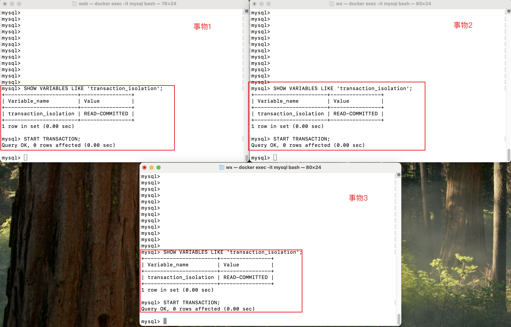
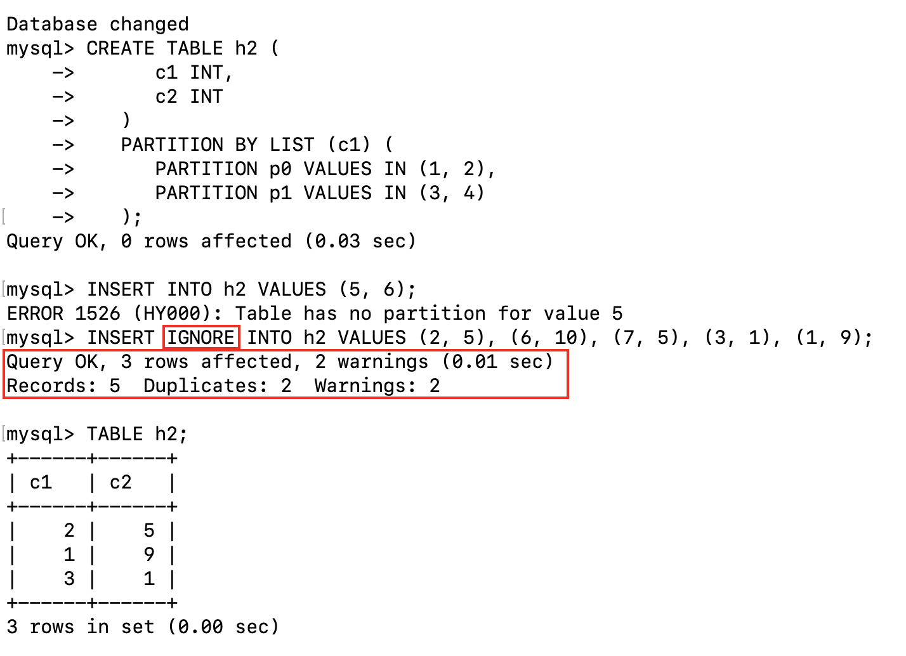
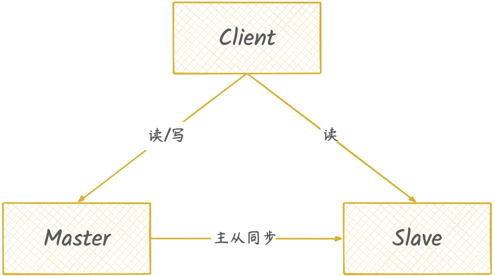
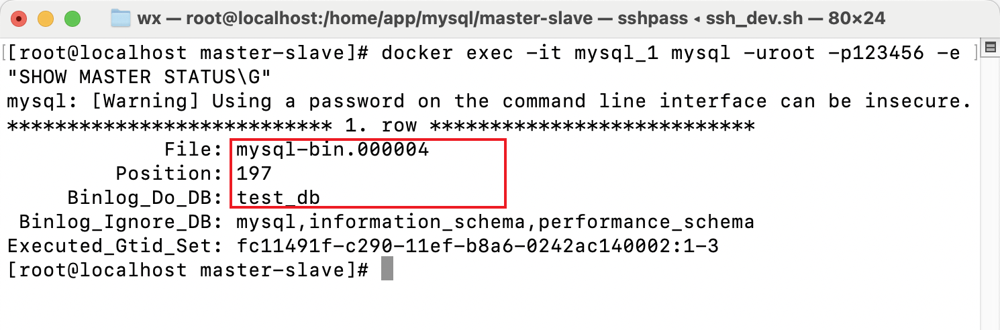

# MySQL

Docker 安装 MySQL8.0，安装见[docker-compose.yaml](./singleton/docker-compose.yaml)

## 操作类型

SQL 程序语言有四种类型，对数据库的基本操作都属于这四种类，分为 DDL、DML、DQL、DCL

1. DDL(Dara Definition Language 数据定义语言)，是负责数据结构定义与数据对象定义的语言，由 create、alter、drop、truncate 四个语法组成

    - create table 创建表
    - alter table 修改表
    - drop table 删除表
    - truncate table 清空表

2. DML(Data Manipulation Language 数据操纵语言)，主要是进行插入数据、修改数据、删除数据的操作，由 insert、update、delete 语法组成
3. DQL(Data Query Language 数据查询语言)，用来进行数据库中的数据查询，最常用的就是 select 语句
4. DCL(Data Control Language 数据控制语言)，用来授权或回收访问数据库的某种特权，并控制数据库操纵事务发生的时间及效果，能够对数据库进行监视

## 存储过程

MySQL数据存储位置可以通过`SHOW VARIABLES LIKE 'datadir';`去获取，每一个数据库都会有一个文件，每一张表都会有一个*.ibd文件，这个文件存储着表数据、索引、UNDO日志等等..

### 表空间文件结构

表空间有文件头(File Header)、段(Segment)、区(Extent)、页(Page)

1. 段(Segment)，段是表空间的逻辑分区，用于管理不同类型的数据，如表的**数据段**、**索引段**、溢出段等
2. 区(Extent)，每个区由多个连续的页组成，默认大小为 1MB（即 64 个连续的 16KB 页）
3. 页(Page)，页是 InnoDB 表空间文件的基本存储单元，每页存储不同的数据内容，如行数据、索引、回滚信息等
4. 行(Row)，行是表中数据的基本逻辑单位，代表每一条记录；记录以特定格式存储在数据页中，并包含实际的列值、元信息（如事务 ID、回滚指针等）


### 数据页结构

数据库I/O操作的最小单位是页，与数据库相关的内容都会存储在页结构里。数据页包括七个部分，分别是文件头（File Header）、页头（Page Header）、最大最小记录（Infimum+supremum）、用户记录（User Records）、空闲空间（Free Space）、页目录（Page Directory）和文件尾（File Tailer）


### 行(Row)格式分类

MySQL 支持以下几种行格式，具体格式由表的 ROW_FORMAT 定义：Compact（紧凑格式）、Redundant（冗余格式，MySQL 早期版本的默认格式）、Dynamic（动态格式）、Compressed（压缩格式）

```sql
CREATE TABLE example (
    id INT,
    name VARCHAR(255)
) ENGINE=InnoDB ROW_FORMAT=COMPACT;
```

以Compact为例

| 字段   | 内容                   | 说明            |
|------|----------------------|---------------|
| 行头信息 | INFO_BITS, HEAP_NO 等 | 用于管理行的元信息     |
| 隐藏列  | TRX_ID, ROLL_PTR 等   | 用于支持事务和回滚     |
| 用户数据 | id=1                 | 定长数据直接存储      |
| 用户数据 | name='Alice'         | 包括长度前缀和实际数据   |
| 用户数据 | age=30               | 定长数据直接存储      |
| 用户数据 | bio 指向溢出页            | 如果数据过大，存储在溢出页 |

## 存储引擎

可以通过`SELECT * FROM INFORMATION_SCHEMA.ENGINES;`查询数据库支持存储引擎，常见的存储引擎有InnoDB、MyISAM


### InnoDB 存储引擎

InnoDB是现在默认的存储引擎，具体参考[官方文档](https://dev.mysql.com/doc/refman/8.0/en/innodb-introduction.html)

1. 事物支持

   - 支持事物，遵循ACID特性

2. 行级锁

   - 采用行级锁，支持高并发
   - 结合多版本并发控制(MVCC)，减少锁争用

3. 外键约束

   - 支持外键约束，确保数据一致性和完整性

4. 崩溃恢复

   - 使用 Redo Log 和 Undo Log 来确保数据在系统崩溃后可以恢复

5. 索引

   - 聚簇索引（Clustered Index）存储数据，主键索引和行数据一起存储
   - 辅助索引，辅助索引存储索引键和指向主键的引用，回表

### MyISAM 存储引擎

MyISAM存储引擎是基于较旧的ISAM存储引擎的扩展，具体参考[官方文档](https://dev.mysql.com/doc/refman/8.0/en/myisam-storage-engine.html)

1. 无事物支持
2. 表级锁
3. 高效读操作
4. 非聚簇索引，数据和索引分开存储
5. 压缩表
6. 不支持外键


### 选择存储引擎

1. 如果系统需要 事务支持、高并发写入、数据一致性（如银行、订单系统）  
   选择 InnoDB

2. 如果系统以 读操作为主、不需要事务支持（如报表系统、数据统计）  
   选择 MyISAM

## 索引

索引是一种用于快速查询和检索数据的数据结构，其本质可以看成是一种排序好的数据结构，索引的作用就相当于书的目录

### 索引分类

1. 按照存储方式划分

   - 聚簇索引：索引结构和数据存一起存放的索引（InnoDB中的主键索引）
   - 非聚簇索引：索引结构和数据分开存放的索引，如二级索引，MyISAM引擎下的索引

2. 按照应用维度划分

   - 主键索引：加速查询 + 列值唯一（不可以有 NULL）+ 表中只有一个
   - 普通索引：仅加速查询
   - 唯一索引：加速查询 + 列值唯一（可以有 NULL）
   - 覆盖索引：一个索引包含（或者说覆盖）所有需要查询的字段的值
   - 联合索引：多列值组成一个索引，专门用于组合搜索，其效率大于索引合并
   - 全文索引：对文本的内容进行分词，进行搜索

3. 按照数据结构划分

   - BTree 索引：最常用的索引类型，叶子节点存储value
   - 哈希索引：类似键值对的形式，一次即可定位
   - 全文索引：对文本的内容进行分词，进行搜索

### BTree

B-Tree（Balanced Tree，平衡树）是一种自我平衡的树数据结构，保持数据有序，时间复杂度为 $O(\log n)$

| 比较项	      | BTree           | 	B+Tree          |
|-----------|-----------------|------------------|
| 数据存储位置	   | 数据存储在叶子节点和非叶子节点 | 	数据仅存储在叶子节点      |
| 索引节点存储内容	 | 键和值	            | 仅存储键             |
| 范围查询效率	   | 较低，需遍历多个节点      | 	高效，叶子节点形成链表     |
| 顺序遍历      | 	需要中序遍历整棵树      | 	通过叶子节点链表直接遍历    |
| 树高度	      | 较高（非叶子节点存储更多数据） | 	较低（非叶子节点存储更少数据） |
| 适用场景	     | 一般的搜索和存储场景	     | 数据库索引、文件系统的最佳选择  |

数据库使用B+Tree的优势

- 更高效的磁盘 IO：非叶子节点占用更少的存储空间，能减少磁盘读取次数，提高性能。
- 更快的范围查询：叶子节点形成链表，适合处理范围查询和排序查询。
- 易于维护：插入和删除操作的复杂度较低，树的平衡性易维护。
- 良好的扩展性：能适应大规模数据和高并发场景。


### 索引失效

1. 字段类型隐式转换

   ```sql
   -- 索引失效
   SELECT * FROM user WHERE id = '1';
   -- 索引生效
   SELECT * FROM user WHERE id = 1;
   ```

2. 索引列参与运算

   ```sql
   -- 索引失效
   SELECT * FROM user WHERE id + 1 = 10;
   -- 索引生效
   SELECT * FROM user WHERE id = 10;
   ```

3. 索引列使用函数

   ```sql
   -- 索引失效
   SELECT * FROM users WHERE SUBSTR(name, 1, 3) = 'Tom'
   -- 索引生效
   SELECT * FROM users WHERE name = 'Tom'
   ```

4. 索引列使用like，且%在前面

   ```sql
   -- 索引失效
   SELECT * FROM users WHERE name LIKE '%Tom%'
   -- 索引生效
   SELECT * FROM users WHERE name = 'Tom'
   ```

5. 数据量比较少，优化器不走索引

6. 索引列使用!=、<>、!<、!>、NOT IN、NOT LIKE、NOT BETWEEN、IS NOT NULL

   ```sql
   -- 索引失效
   SELECT * FROM users WHERE id != 1;
   -- 索引生效
   SELECT * FROM users WHERE id = 1;
   ```

7. 容易误解的地方是 <、> 走不走索引，在MySQL8.0中，<、> 针对数字类型走索引会走索引

   - 当匹配的数据量超过表总数据量的20%-30%时，优化器倾向于选择全表扫描，索引也会失效

8. 索引列使用OR
9. 索引列使用复合索引， 违反最左前缀原则

## 数据库优化

数据库优化，为了提高SQL的执行效率，更加快速的完成SQL运行，可以数据库层面和硬件层面两个方面进行优化。  
硬件层面造成的瓶颈通常有：磁盘寻道、磁盘读写、CPU周期、内存带宽等等。这里主要是从数据库层进行优化，详情参看[官方文档](https://dev.mysql.com/doc/refman/8.0/en/optimize-overview.html)

### SQL执行过程

在开始数据库优化之前，先了解SQL查询语句如何执行的，执行`SELECT`语句时，执行的先后顺序.

1. [SQL 查询语句执行过程](https://www.xiaolincoding.com/mysql/base/how_select.html)

   - 连接器：建立连接，管理连接、校验用户身份
   - 查询缓存：查询语句如果命中查询缓存则直接返回，否则继续往下执行。MySQL 8.0已删除
   - 解析SQL：通过解析器对SQL查询语句进行词法分析、语法分析，构建语法树，便于后续模板读取表明、字段、语句类型
   - 执行SQL
     - 预处理阶段：检查表或字段是否存在
     - 优化阶段：基于查询成本的考虑，选择查询成本最小的执行计划
     - 执行阶段：根据执行计划执行SQL查询语句，从存储引擎读取记录

2. SELECT执行顺序  
   关键字顺序：
   ```sql
   SELECT ... FROM ... WHERE ... GROUP BY ... HAVING ... ORDER BY ...
   ```

   SELECT语句的执行顺序
   ```sql
   FROM = JOIN > WHERE > GROUP BY > HAVING > SELECT的字段 > DISTINCT > ORDER BY > LIMIT
   ```

   比如一个SQL语句，它的关键字顺序和执行顺序是下面这样的：
   ```sql
   SELECT DISTINCT player_id, player_name, count(*) as num #顺序5
   FROM player JOIN team ON player.team_id = team.team_id #顺序1
   WHERE height &gt; 1.80 #顺序2
   GROUP BY player.team_id #顺序3
   HAVING num &gt; 2 #顺序4
   ORDER BY num DESC #顺序6
   LIMIT 2 #顺序7
   ```
   在SELECT语句执行这些步骤的时候，每个步骤都会产生一个虚拟表，然后将这个虚拟表传入下一个步骤中作为输入

### 优化数据库结构
1. 在建数据表时，先预估数据表的容量，数据表存放的数据量较大，要对数据表进行[分区](#分区)
2. 优化数据类型
   - 优先使用数字类型的做唯一ID
   - 对于大小小于8KB的列值，使用二进制VARCHAR而不是BLOB
3. 数据库和表的数量限制
   - MySQL 对数据库的数量没有限制。底层文件系统可能对目录的数量有限制
   - InnoDB最多允许 40 亿个表
4. 数据表大小限制，InnoDB表，对于大于 1TB 的表，建议将表分区为多个表空间文件
5. 数据表行数和列数限，InnoDB表
   - 一个表最多可以包含 1017 个列。虚拟生成的列也包含在该限制内
   - 一个表最多可以包含64个 二级索引
   - 行数没有明确要求，但是和数据表“页”相关
6. [配置缓冲池](https://dev.mysql.com/doc/refman/8.0/en/innodb-performance-buffer-pool.html)

### 优化SQL
优化SQL需要一个过程的优化和判断才能达到预期  
1. 优化SQL语句(// 感觉现在整理的不够 todo)

   - 避免使用`select *`进行查询
   - 索引优化，建立合适索引，在查询时保证索引生效
   - 连接优化，小表连接大表，连接条件尽可能的缩小表的大小
   
2. 建立合适索引，甄别正确的列做二级索引和二级联合索引，合理使用覆盖索引，避免[索引失效](#索引失效)，MySQL创建索引

   ```sql
   CREATE [UNIQUE | FULLTEXT | SPATIAL] INDEX index_name
      [index_type]
      ON tbl_name (key_part,...)
      [index_option]
      [algorithm_option | lock_option] ...

   key_part: {col_name [(length)] | (expr)} [ASC | DESC]

   index_option: {
      KEY_BLOCK_SIZE [=] value
   | index_type
   | WITH PARSER parser_name
   | COMMENT 'string'
   | {VISIBLE | INVISIBLE}
   | ENGINE_ATTRIBUTE [=] 'string'
   | SECONDARY_ENGINE_ATTRIBUTE [=] 'string'
   }

   index_type:
      USING {BTREE | HASH}

   algorithm_option:
      ALGORITHM [=] {DEFAULT | INPLACE | COPY}

   lock_option:
      LOCK [=] {DEFAULT | NONE | SHARED | EXCLUSIVE}
   ```

3. SQL分析，使用EXPLAIN优化查询，去分析SQL执行日志，日志字段含义解释如下  
   - **id**: 查询的<font color='red'>唯一标识符</font>
     - 在单个简单查询中，通常这个值为1。在复杂查询中，如包含子查询、联合查询（UNION）或是多表连接的查询，id的值可以帮助你理解查询的执行顺序和结构
     - 相同的id值表示这些操作是在同一个级别执行的。例如，在JOIN操作中，参与相同JOIN的表会有相同的id值。
   - **select_type**: 查询的类型（如 SIMPLE, PRIMARY, SUBQUERY 等）
     - SIMPLE 表示一个<font color='red'>简单的SELECT</font>（不使用UNION或子查询的情况）
     - PRIMARY 一个<font color='red'>复杂的查询</font>中（比如涉及到 UNION 或子查询的情况），最外层的查询被标记为 PRIMARY
     - SUBQUERY 查询中<font color='red'>包含子查询</font>时，子查询的 select_type 是 SUBQUERY
   - **table**: 正在访问的表。
   - **type**: 表示连接类型（如ALL、index、range等）。
     - system 表只有一行（等同于系统表）。这是可能的最好的 type 值，查询速度非常快
     - const 表示通过<font color='red'>索引一次就能找到一行数据</font>，通常用于比较主键或唯一索引的等值查询
     - eq_ref 在使用<font color='red'>主键或唯一索引作为连接条件</font>时
     - ref 访问类型只返回匹配某个单个值的行，它使用非唯一或非主键索引
     - fulltext 全文索引
     - unique_subquery 在 IN 子句中使用的子查询将被优化为一个唯一查询
     - index_subquery 类似于 unique_subquery，但用于非唯一索引
     - range <font color='red'>只检索给定范围内的行，使用索引来选择行</font>
     - index 表示全索引扫描，比全表扫描快，但不如 range 类型
     - all  表示全表扫描，这通常是<font color='red'>性能最差</font>的情况，应尽可能避免
   - **possible_keys**: 可能用于查询的索引。
   - **key**: 实际使用的索引。
   - **key_len**: 索引使用的字节数。
   - **ref**: 显示索引如何被使用，如列名或常量。
   - **rows**: 估计查询需要检查的行数。
   - **Extra**: 额外的信息（如**Using where**、**Using index**等）
     - Using filesort 表明 MySQL 将使用一个外部索引排序，而不是按索引顺序进行读取。这通常发生在 ORDER BY 查询中，指定的排序无法通过索引直接完成
     - Using temporary 表示 MySQL 需要使用临时表来存储结果，这通常发生在排序和分组查询中（例如，含有 GROUP BY、DISTINCT、ORDER BY 或多表 JOIN）
     - Using index 查询能够通过只访问索引来获取所需的数据，无需读取实际的表行。这通常是性能较好的情况
     - Using where 指 MySQL 在存储引擎层面之外进行了额外的过滤

   根据分析报告，主要查看SQL是否按预期走索引获取结果，如果出现嵌套循环等，应该尝试打破嵌套循环。更多查询执行计划报告见[MySQL原文](https://dev.mysql.com/doc/refman/8.0/en/execution-plan-information.html)

最后引用[美团技术团队的一段话](https://tech.meituan.com/2014/06/30/mysql-index.html)，任何数据库层面的优化都抵不上应用系统的优化，同样是MySQL，可以用来支撑Google/FaceBook/Taobao应用，但可能个人网站都撑不住。套用最近比较流行的话：“查询容易，优化不易，且写且珍惜！”


## SQL语句

SQL的语法有很多很多，正常工作只会对部分的语句使用，这里主要学习一下不常用的SQL语句，以及它们的作用，丰富一下知识面

## 锁

[InnoDB Locking](https://dev.mysql.com/doc/refman/8.0/en/innodb-locking.html)

1. 共享锁与排他锁 (Shared and Exclusive Locks)

   - 共享锁(S锁)：允许其他事务读取数据，但不允许其他事务修改数据

   ```sql
   SELECT * FROM table_name WHERE id = 1 LOCK IN SHARE MODE;
   -- 或
   SELECT * FROM users WHERE id = 1 FOR SHARE;
   ```

   - 排他锁(X锁)：允许其他事务读取和修改数据

   ```sql
   SELECT * FROM table_name WHERE id = 1 FOR UPDATE;
   ```

2. 意向锁 (Intention Locks)

   - 意向锁是一种表级锁，用于表示事务将要对表中的某些行进行加锁
   ```sql
   -- 意向锁是表级锁，在获取行锁之前自动设置
   -- 意向共享锁（IS）：表示事务打算给表中的某些行加共享锁
   SELECT * FROM table_name WHERE id = 1 LOCK IN SHARE MODE;
   -- 意向排他锁（IX）：表示事务打算给表中的某些行加排他锁
   SELECT * FROM table_name WHERE id = 1 FOR UPDATE;
   ```

3. 记录锁 (Record Locks)

   - 记录锁是一种行级锁，用于锁定单个行

   ```sql
   SELECT * FROM table_name WHERE id = 1 FOR UPDATE;
   -- 特点：
   -- 锁定单个索引记录
   -- 防止其他事务修改或删除该记录
   -- 必须是精确匹配的查询条件
   ```

4. 间隙锁 (Gap Locks)

   - 间隙锁是一种间隙级锁，用于锁定索引记录之间的间隙

   ```sql
   SELECT * FROM table_name WHERE id BETWEEN 1 AND 10 FOR UPDATE;
   ```
   特点：
   - 锁定范围，防止其他事务在范围内插入数据
   - 防止幻读
   - 只在REPEATABLE READ隔离级别下生效

5. 临键锁 (Next-Key Locks)

   - 临键锁是一种行级锁，用于锁定索引记录及其之间的间隙

   ```sql
   -- Record Lock + Gap Lock
   SELECT * FROM users WHERE age > 20 FOR UPDATE;
   ```

   - 特点：
     - 锁定索引记录及其之间的间隙
     - 防止幻读
     - 在REPEATABLE READ隔离级别下生效

6. 插入意向锁 (Insert Intention Locks)

   - 插入新记录时自动获取

7. 自增锁 (Auto Increment Locks)

   - 自增锁是一种表级锁，用于确保多个事务对自增列的并发插入操作的正确性
   ```sql
   CREATE TABLE t1 (
     c1 INT(11) NOT NULL AUTO_INCREMENT,
     c2 VARCHAR(10) DEFAULT NULL,
     PRIMARY KEY (c1)
   ) ENGINE=InnoDB;
   ```

## 事物

事务（Transaction）是一组作为单个逻辑工作单元执行的SQL语句，它具有ACID特性：

   - 原子性（Atomicity）：事务中的所有操作要么全部成功，要么全部失败，不能部分成功或部分失败
   - 一致性（Consistency）：事务执行前后，数据库的状态保持一致
   - 隔离性（Isolation）：多个事务并发执行时，每个事务的执行结果不受其他事务的影响
   - 持久性（Durability）：事务一旦提交，对数据库的修改将永久保存

### 事务隔离级别

并发控制时会出现问题

   - 脏读：一个事务读取另一个事务未提交的数据
   - 不可重复读：同一事务内多次读取数据时，数据发生变化
   - 幻读：事务之间的数据插入或删除导致查询结果不一致


MySQL的隔离级别可以解决上述问题，支持四种隔离级别  
1. 读未提交（Read Uncommitted）

   - 允许脏读、不可重复读和幻读
   - 事务可以读取其他事务未提交的数据

2. 读已提交（Read Committed）

   - 解决了脏读问题，但仍然可能发生不可重复读和幻读
   - 事务只能读取其他事务已提交的数据

3. 可重复读（Repeatable Read）

   - 解决了脏读和不可重复读问题，但仍然可能发生幻读
   - 事务会对读取的数据加锁，保证该数据在事务内不会被修改

4. 串行化（Serializable）

   - 解决了脏读、不可重复读和幻读问题
   - 对同一行记录，写操作会加锁，读操作会加共享锁，从而避免幻读


```sql
-- 查看当前事务隔离级别
SHOW VARIABLES LIKE 'transaction_isolation';
-- 设置事务隔离级别
-- READ-UNCOMMITTED（最低级别）
-- READ-COMMITTED
-- REPEATABLE-READ（MySQL 的默认隔离级别）
-- SERIALIZABLE（最高级别）
SET GLOBAL transaction_isolation = 'REPEATABLE-READ';
-- 开启事务
START TRANSACTION;
-- 提交事务
COMMIT;
```

### MVCC

在MySQL中，默认的隔离级别是可重复读，可以解决脏读和不可重复读的问题，但不能解决幻读问题。如果想要解决幻读问题，就需要采用串行化的方式，也就是将隔离级别提升到最高，但这样一来就会大幅降低数据库的事务并发能力。  
主要解决了在高并发环境下的数据库读写冲突问题，它允许事务处理更加高效，同时提高了数据库的整体性能和可靠性

#### 什么是快照读和当前读？

1. 快照读读取的数据是快照数据，不加锁的简单的SELECT操作都属于快照读
2. 当前读读取的数据是当前最新的数据，需要加锁的SELECT操作都属于当前读

快照读就是普通的读操作，而当前读包括了加锁的读取和DML操作

#### 什么是 MVCC

MVCC（Multi-Version Concurrency Control，多版本并发控制），通过数据行的多个版本管理来实现数据库的并发控制，它的思想就是保存数据的历史版本  
在并发读写数据库时，可以做到在读操作时不用阻塞写操作，写操作也不用阻塞读操作，提高了数据库并发读写的性能。同时还可以解决脏读，幻读，不可重复读等事务隔离问题，但不能解决更新丢失问题


#### MVCC实现原理

MVCC 的实现主要依赖于：隐藏字段、`undo log`、Read View。  
在内部实现中，InnoDB 通过数据行的 DB_TRX_ID 和 Read View 来判断数据的可见性，如不可见，则通过数据行的 DB_ROLL_PTR 找到 undo log 中的历史版本。每个事务读到的数据版本可能是不一样的，在同一个事务中，用户只能看到该事务创建 Read View 之前已经提交的修改和该事务本身做的修改

[原文](https://dev.mysql.com/doc/refman/8.0/en/innodb-multi-versioning.html)

##### 隐藏字段

每条行记录除了自定义之外，InnoDB 还维护了以下隐藏字段
```sql
CREATE TABLE users (
   id INT,
   name VARCHAR(50)
   -- 以下是InnoDB自动维护的隐藏字段
   -- DB_TRX_ID     -- 事务ID：记录最后一次修改该行的事务ID
   -- DB_ROLL_PTR   -- 回滚指针：指向上一个版本的记录
   -- DB_ROW_ID     -- 如果没有设置主键且该表没有唯一非空索引时，InnoDB 会使用该 id 来生成聚簇索引
);
```

##### undo log

`undo log` 是用于事物回滚；当读取记录时，该记录被其他事物占用，则需要通过`undo log`来找到之前的数据版本，实现非锁定读。`undo log`主要分为两类：

- insert undo log：事务对`insert`操作的`undo log`，`insert`操作的记录只对事务本身可见，对其他事务不可见，事务提交后，该`undo log`可以直接删除
- update undo log：事务对`update`操作的`undo log`，事务提交后，该`undo log`会被`purge线程`删除

不同事物或者相同事物对同一行记录的`update`或者`delete`操作，会使该记录行的`undo log`成为一条链表，链首就是最新的记录，链尾就是最早的旧记录

##### Read View

Read View 记录了当前事务能看到的版本，这些版本的数据基于事务开始时的快照。  
Read View的结构，[Read View](https://github.com/facebook/mysql-8.0/blob/8.0/storage/innobase/include/read0types.h#L298)主要是用来做可见行判断，主要字段有

- m_low_limit_id：目前出现过的最大的事务 ID+1，即下一个将被分配的事务 ID。大于等于这个 ID 的数据版本均不可见
- m_up_limit_id：活跃事务列表 m_ids 中最小的事务 ID，如果 m_ids 为空，则 m_up_limit_id 为 m_low_limit_id。小于这个 ID 的数据版本均可见
- m_ids：Read View 创建时其他未提交的活跃事务 ID 列表。创建 Read View时，将当前未提交事务 ID 记录下来，后续即使它们修改了记录行的值，对于当前事务也是不可见的。m_ids 不包括当前事务自己和已提交的事务（正在内存中）
- m_creator_trx_id：创建该 Read View 的事务 ID

##### RC 和 RR 隔离级别下 MVCC 的差异

在事务隔离级别 RC 和 RR （InnoDB 存储引擎的默认事务隔离级别）下，InnoDB 存储引擎使用 MVCC（非锁定一致性读），但它们生成 Read View 的时机却不同

- 在 RC 隔离级别下，每次select查询会生成并获取最新的Read View(m_ids 列表)
- 在 RR 隔离级别下，同一个事务中的第一个快照读才会创建Read View，之后的快照读获取的都是同一个Read View

##### MVCC 解决不可重复读问题

举个例子：

|     | 事物1                                     | 事物2                                        | 事物3                             |
|:----|:----------------------------------------|:-------------------------------------------|:--------------------------------|
| T1  | START TRANSACTION;                      |                                            |                                 |
| T2  |                                         | START TRANSACTION;                         | START TRANSACTION;              |
| T3  | update users set name='Job' where id=1; |                                            |                                 |
| T4  | select * from users where id=1;         | select * from users where id=1;            |                                 |
| T5  | update users set name='Tom' where id=1; |                                            |                                 |
| T6  | select * from users where id=1;         |                                            | select * from users where id=1; |
| T7  | commit;                                 | update users set name='Bill' where id=1;   |                                 |
| T8  |                                         |                                            | select * from users where id=1; |
| T9  |                                         | update users set name='Andrew' where id=1; |                                 |
| T10 |                                         | commit;                                    | select * from users where id=1; |
| T11 |                                         |                                            | commit;                         |

**在RR隔离级别下**

- T2 时刻


- T4 时刻


- T6 时刻


- T8 时刻


- T10 时刻


**在RC隔离级别下**

- T2 时刻



- T4 时刻


- T6 时刻


- T8 时刻


- T10 时刻


// todo 按照 read view 分析 ...

##### MVCC➕Next-key-Lock 防止幻读

1. 执行普通 select，此时会以 MVCC 快照读的方式读取数据  
   RR 隔离级别只会在事务开启后的第一次查询生成 Read View ，并使用至事务提交。所以在生成 Read View 之后其它事务所做的更新、插入记录版本对当前事务并不可见，实现了可重复读和防止快照读下的 “幻读”

2. 执行 select...for update/lock in share mode、insert、update、delete 等当前读  
   当前读读取的是最新的数据，并且会对读取到的数据加锁，防止其他事务修改或删除该数据。在执行 insert、update、delete 操作时，会以当前读的方式读取数据，并加锁，防止其它事务在查询范围内插入数据，从而实现防止幻读

## 分区

MySQL 8.0中的分区是将数据表按一定的规则划分成多个子表，这些子表被称为“分区”。分区可以帮助提高大数据量表的性能，特别是在执行查询、更新、删除等操作时。详情参考[原文](https://dev.mysql.com/doc/refman/8.0/en/partitioning-overview.html)

### 分区类型

1. [范围分区(RANGE Partitioning)](https://dev.mysql.com/doc/refman/8.0/en/partitioning-range.html)  
   范围分区是根据列的值将数据分配到不同的分区中，每个分区包含的值范围是连续的。
   
   ```sql
   CREATE TABLE employees (
      id INT NOT NULL,
      fname VARCHAR(30),
      lname VARCHAR(30),
      hired DATE NOT NULL DEFAULT '1970-01-01',
      separated DATE NOT NULL DEFAULT '9999-12-31',
      job_code INT NOT NULL,
      store_id INT NOT NULL
   )
   PARTITION BY RANGE (store_id) (
      PARTITION p0 VALUES LESS THAN (6),
      PARTITION p1 VALUES LESS THAN (11),
      PARTITION p2 VALUES LESS THAN (16),
      PARTITION p3 VALUES LESS THAN (21)
   );
   ```
   
   商店 1 到 5 的员工对应的所有数据存储在分区中 p0，商店 6 到 10 的员工对应的所有数据存储在分区中p1，以此类推。这里会有一个问题是`store_id`大于20之后会报错：`SQL 错误 [1526] [HY000]: Table has no partition for value 21`。也可以使用`ALTER TABLE`语句来添加新的分区，使用`DROP PARTITION`语句来删除分区。

   ```sql
   -- 添加分区
   ALTER TABLE employees ADD PARTITION (PARTITION p4 VALUES LESS THAN (26));
   -- 删除分区
   ALTER TABLE employees DROP PARTITION p4;
   
   CREATE TABLE employees (
      id INT NOT NULL,
      fname VARCHAR(30),
      lname VARCHAR(30),
      hired DATE NOT NULL DEFAULT '1970-01-01',
      separated DATE NOT NULL DEFAULT '9999-12-31',
      job_code INT NOT NULL,
      store_id INT NOT NULL
   )
   PARTITION BY RANGE (store_id) (
      PARTITION p0 VALUES LESS THAN (6),
      PARTITION p1 VALUES LESS THAN (11),
      PARTITION p2 VALUES LESS THAN (16),
      PARTITION p3 VALUES LESS THAN MAXVALUE -- 最大值 MAXVALUE表示一个整数值，该值始终大于最大可能整数值（在数学语言中，它充当 最小上界）
   );
   ```

2. [列表分区(LIST Partitioning)](https://dev.mysql.com/doc/refman/8.0/en/partitioning-list.html)  
   列表分区在许多方面与范围分区相似，每个分区都必须明确定义。这两种分区类型之间的主要区别在于，在列表分区中，每个分区都是根据列值在一组值列表之一中的成员资格来定义和选择的，而不是在一组连续值范围之一中定义和选择的。这是通过使用其中 是列值或基于列值的表达式并返回整数值，然后通过定义每个分区来完成的。
   
   ```sql
   CREATE TABLE h2 (
      c1 INT,
      c2 INT
   )
   PARTITION BY LIST (c1) (
      PARTITION p0 VALUES IN (1, 2),
      PARTITION p1 VALUES IN (3, 4)
   );
   ```

   c1 的值为 1 或 2 的数据存储在分区 p0，c1 的值为 3 或 4 的数据存储在分区 p1，如果 c1 的值为 5，则会报错：`SQL 错误 [1526] [HY000]: Table has no partition for value 5`，如果想避免这种错误，可以`IGNORE`让编辑器忽略错误，给出警告

   ```sql
   INSERT IGNORE INTO h2 VALUES (2, 5), (6, 10), (7, 5), (3, 1), (1, 9);
   -- Query OK, 3 rows affected, 2 warnings (0.01 sec)
   -- Records: 5  Duplicates: 2  Warnings: 2
   ```

   

   这里我要吐槽一个点，列表分区的分区列，没有默认分区，[原文](https://dev.mysql.com/doc/refman/8.0/en/partitioning-list.html)Unlike the case with RANGE partitioning, there is no “catch-all” such as MAXVALUE; all expected values for the partitioning expression should be covered in PARTITION ... VALUES IN (...) clauses. An INSERT statement containing an unmatched partitioning column value fails with an error

3. [哈希分区(HASH Partitioning)](https://dev.mysql.com/doc/refman/8.0/en/partitioning-hash.html)  
   使用HASH进行分区主要是为了确保数据在预定数量的分区中均匀分布。对于范围或列表分区，必须显式指定应该将给定的列值或列值集存储在哪个分区中；Hash分区通过对某个（或多个）列的值应用哈希算法，计算出一个哈希值，然后将这个哈希值映射到不同的分区。

   ```sql
   CREATE TABLE employees (
      id INT NOT NULL,
      fname VARCHAR(30),
      lname VARCHAR(30),
      hired DATE NOT NULL DEFAULT '1970-01-01',
      separated DATE NOT NULL DEFAULT '9999-12-31',
      job_code INT,
      store_id INT
   )
   PARTITION BY HASH(store_id)
   PARTITIONS 4;
   ```

   除了常规哈希分区，还有线性哈希分区，它与常规散列的不同之处在于，线性散列利用线性二次幂算法，而常规散列采用散列函数值的模数。

   ```sql
   CREATE TABLE employees (
      id INT NOT NULL,
      fname VARCHAR(30),
      lname VARCHAR(30),
      hired DATE NOT NULL DEFAULT '1970-01-01',
      separated DATE NOT NULL DEFAULT '9999-12-31',
      job_code INT,
      store_id INT
   )
   PARTITION BY LINEAR HASH( YEAR(hired) ) PARTITIONS 4;
   ```

4. [键分区(KEY Partitioning)](https://dev.mysql.com/doc/refman/8.0/en/partitioning-key.html)  
   `Key Partitioning`是MySQL分区的一种方式，它基于指定列的哈希值来将数据分配到不同的分区。与`Hash Partitioning`类似，`Key Partitioning`也是通过计算某个或多个列的哈希值来决定数据应该放置在哪个分区，但与Hash分区不同的是，`Key Partitioning`使用的是MySQL内部的哈希函数，而不是用户定义的哈希函数

   ```sql
   CREATE TABLE k1 (
      id INT NOT NULL,
      name VARCHAR(20),
      UNIQUE KEY (id)
   )
   PARTITION BY KEY()
   PARTITIONS 2;
   ```

5. [复合分区(Composite Partitioning)](https://dev.mysql.com/doc/refman/8.0/en/partitioning-composite.html)  
   复合分区是对分区表中的每个分区进行进一步划分，复合分区可以结合多种分区类型，例如，可以结合范围分区、列表分区、哈希分区等

   ```sql
   CREATE TABLE ts (id INT, purchased DATE)
      PARTITION BY RANGE( YEAR(purchased) )
      SUBPARTITION BY HASH( TO_DAYS(purchased) ) (
         PARTITION p0 VALUES LESS THAN (1990) (
               SUBPARTITION s0,
               SUBPARTITION s1
         ),
         PARTITION p1 VALUES LESS THAN (2000) (
               SUBPARTITION s2,
               SUBPARTITION s3
         ),
         PARTITION p2 VALUES LESS THAN MAXVALUE (
               SUBPARTITION s4,
               SUBPARTITION s5
         )
    );
   ```

### 分区管理

1. [RANGE 和 LIST 分区的管理](https://dev.mysql.com/doc/refman/8.0/en/partitioning-management-range-list.html)

   ```sql
   create table h (
      c1 int,
      c2 int
   )
   partition by RANGE (c1) (
      partition s1 VALUES less than(5),
      partition s2 VALUES less than(10),
   -- 	partition s3 VALUES less than MAXVALUE
   );
   ```
   - 添加分区
   ```sql
   ALTER TABLE h ADD PARTITION (PARTITION s4 VALUES LESS THAN (27));
   -- 注意事项：
   -- 1. 添加分区时，新分区的值必须大于现有分区的最大值
   -- 2. 如果设置了MAXVALUE，则无法添加新的分区
   ```
   - 删除分区
   ```sql
   ALTER TABLE employees DROP PARTITION p4;
   -- 注意事项：
   -- 1. 删除分区时，分区中的数据会被删除
   -- 2. 删除分区时，分区中的索引会被删除
   -- 3. 删除分区时，分区中的触发器会被删除
   ```

   - 重定义分区
   ```sql
   ALTER TABLE h REORGANIZE PARTITION s1 INTO (
      PARTITION n0 VALUES LESS THAN (2),
      PARTITION n11 VALUES LESS THAN (3)
   );
   ```
   
   - 合并分区
   ```sql
   ALTER TABLE h REORGANIZE PARTITION s1, s2 INTO (
      PARTITION n0 VALUES LESS THAN (4)
   );

   -- 拆分或合并分区不会丢失任何数据 
   ```

   - 清空分区
   ```sql
   ALTER TABLE h TRUNCATE PARTITION s1;
   ```

2. [HASH 和 KEY 分区的管理](https://dev.mysql.com/doc/refman/8.0/en/partitioning-management-hash-key.html)

   ```sql
   CREATE TABLE clients (
      id INT,
      fname VARCHAR(30),
      lname VARCHAR(30),
      signed DATE
   )
   PARTITION BY HASH( MONTH(signed) )
   PARTITIONS 12;
   ```

   - 添加分区
   ```sql
   ALTER TABLE clients ADD PARTITION PARTITIONS 6;
   ```

   - 减少分区
   ```sql
   ALTER TABLE clients COALESCE PARTITION 4;
   ```

### 分区的限制和局限性

1. 分区键必须是整数或NULL
2. 最大分区数（包含子分区）：8192
3. 不能使用外键


#### 分区键与唯一键的关系
1. 分区键的定义和要求
   
   - **分区键**：用于将表中的数据分配到不同的分区。每个分区包含表中一部分数据。分区键是用来决定每行数据存储在哪个分区的列或表达式。
   - 在 MySQL 中，分区键必须是表的所有主键列或唯一键列的一部分。这意味着，如果你为一个表设置分区，表的主键或唯一键必须包含在分区定义的键中。

2. 唯一键与分区键的关系

   - **唯一键约束**：用于保证表中每一行数据的唯一性。MySQL 允许通过一个或多个列创建唯一键约束。
   - 当使用分区时，唯一键（包括主键）和分区键有一个关键的关系：每个分区的唯一键必须是**跨分区唯一**的。这意味着所有分区加起来的唯一键必须在全局范围内唯一。
   - **在分区表中，分区键必须包含在唯一键的组成部分中**。也就是说，唯一键必须包含分区键。否则，可能会导致分区之间的数据重复，从而违反唯一性约束。

3. 主键与唯一键的限制
   
   - 如果表有主键（PRIMARY KEY），则**主键列必须包含分区键**。否则，数据库无法确定每行数据应该分配到哪个分区，违反了分区规则。
   - 对于非主键的唯一键（UNIQUE KEY），其列也必须包含分区键的一部分。否则，MySQL 无法保证唯一性约束的有效性，因为分区可能会导致在不同分区中插入重复的数据。
   - 在某些情况下，可能会因为分区键的限制而无法在表中定义一些复杂的唯一键。

4. 如何设计分区键和唯一键
   
   - 在设计分区表时，应确保分区键与主键或唯一键结合使用，遵循这些约束。
   - 在创建分区表时，需要特别注意分区键的选择，因为它会影响性能以及表的数据分布。合理的选择分区键不仅能优化查询性能，还能避免与唯一键约束产生冲突。

## 数据备份

## 复制

MySQL主从复制，主要是将数据存储在多个节点上，在主节点上进行读写，从节点进行读取，主节点和从节点之间通过主从同步进行数据同步，[原文链接](https://dev.mysql.com/doc/refman/8.0/en/replication.html)。



主从模式主要解决的问题是：
1. 数据备份：通过将数据复制到多个从节点，可以实现数据备份，提高数据的安全性。  
2. 读写分离：通过将读操作分配到从节点，可以提高读取性能，减轻主节点的压力。
3. 高可用性：通过将主节点和从节点分开部署，可以提高系统的可用性，即使主节点出现故障，也可以通过从节点继续提供服务。

### 配置

#### 配置文件

每个服务器都必须配置一个唯一的服务器 ID，您可以使用 server_id系统变量指定该 ID。此服务器 ID 用于标识复制拓扑中的各个服务器，并且必须是 $1\sim2^{32}-1$ 之间的正整数。MySQL 8.0 中的默认 server_id值为 1，可以在my.cnf文件中配置，也可以在启动时使用--server-id选项指定。

#### 配置复制用户

```sql
CREATE USER 'repl'@'%' IDENTIFIED BY '123456';
GRANT REPLICATION SLAVE ON *.* TO 'repl'@'%';
FLUSH PRIVILEGES;
SHOW MASTER STATUS;

-- 查看主节点状态
SHOW MASTER STATUS\G
-- 查看从节点状态
SHOW SLAVE STATUS\G
```

#### 在副本服务器上配置

```sql
CHANGE MASTER TO
MASTER_HOST='192.168.3.222',
MASTER_USER='repl',
MASTER_PORT=3306,
MASTER_PASSWORD='123456',
MASTER_AUTO_POSITION=1;
START SLAVE;
```

在MySQL客户端执行`SHOW SLAVE STATUS\G`查看从库是否连接成功，如果不成功，查看日志，并重置同步
```sql
-- 查看详细错误信息
SHOW SLAVE STATUS\G

-- 如果需要重置同步
STOP SLAVE;
RESET SLAVE;

CHANGE MASTER TO
MASTER_HOST='192.168.3.222',
MASTER_USER='repl',
MASTER_PORT=3306,
MASTER_PASSWORD='123456',
MASTER_AUTO_POSITION=1;

-- 启动从库
START SLAVE;
```

### 实现

- Docker 部署，详情见[docker-compose.yaml](./master-slave/docker-compose.yaml)
- 启动`mysql_1`，`docker-compose up -d mysql_1`，查看主节点信息：`docker exec -it mysql_1 mysql -uroot -p123456 -e "SHOW MASTER STATUS\G"`
   

- 启动`mysql_2`，`docker-compose up -d mysql_2`，连接从节点，设置主节点信息
   ```sql
   CHANGE MASTER TO
   MASTER_HOST='192.168.3.222',
   MASTER_USER='repl',
   MASTER_PORT=3306,
   MASTER_PASSWORD='123456',
   MASTER_AUTO_POSITION=1;
   
   START SLAVE;
   
   ```

- 查看从库状态，`docker exec -it mysql_2 mysql -uroot -p123456 -e "SHOW SLAVE STATUS\G"`，主从复制正常的标志如下：

   - Slave_IO_Running 和 Slave_SQL_Running 都是 Yes
   - Seconds_Behind_Master 接近 0
   - 主从库数据一致
   - 没有复制错误
   - 网络连接稳定


- 测试主从复制

   ```sql
   -- 在主库执行
   CREATE DATABASE test_db;
   USE test_db;
   CREATE TABLE users (
      id INT PRIMARY KEY,
      name VARCHAR(50)
   );
   INSERT INTO users VALUES (1, '测试用户');
   
   -- 在从库执行，由于从库被设置为只读，所以无法插入数据，但是使用超级管理员，还是可以修改数据，
   USE test_db;
   SELECT * FROM users;  -- 应该能看到主库插入的数据
   ```

### 注意事项

MySQL主从复制，对比Redis的主从，MySQL更加容易出错，一下说明常见的错误，详情参见[官方文档](https://dev.mysql.com/doc/refman/8.0/en/replication-notes.html)

1. 主库和从库的server_id不能相同
2. 主库和从库的binlog格式必须相同
3. 主库和从库的binlog日志文件和位置必须相同
4. 主库和从库的binlog日志文件和位置必须相同

## 集群

MySQL NDB Cluster 是适用于分布式计算环境的高可用性、高冗余版本，它使用**NDB存储引擎**（也称为 NDB CLUSTER）支持在集群中运行多台具有 MySQL 服务器和其他软件的计算机，[原文](https://dev.mysql.com/doc/refman/8.0/en/mysql-cluster.html)。

集群节点有三种类型，在最小 NDB 集群配置中，至少有三个节点，每种类型一个：

- 管理节点：此类节点的作用是管理 NDB 群集内的其他节点，执行提供配置数据、启动和停止节点以及运行备份等功能
- 数据节点：这种类型的节点存储集群数据。数据节点的数量与片段副本的数量乘以片段的数量相同
- SQL 节点：这是访问群集数据的节点

### InnoDB VS NDB Cluster

NDB 和 InnoDB用作MySQL事务型存储引擎，他们有很多共同特征，但在框架和实现上存在差异

| 特性                 | InnoDB (MySQL 8.0)                 | NDB 8.0                                                              |
|--------------------|------------------------------------|----------------------------------------------------------------------|
| **MySQL 服务器版本**    | 8.0                                | 8.0                                                                  |
| **InnoDB 版本**      | InnoDB 8.0.40                      | InnoDB 8.0.40                                                        |
| **NDB 集群版本**       | 不适用                                | NDB 8.0.41/8.0.41                                                    |
| **存储限制**           | 64TB                               | 128TB                                                                |
| **外键支持**           | 是                                  | 是                                                                    |
| **事务支持**           | 支持所有标准类型                           | READ COMMITTED                                                       |
| **多版本并发控制 (MVCC)** | 是                                  | 否                                                                    |
| **数据压缩**           | 是                                  | 否（NDB 检查点和备份文件可以压缩）                                                  |
| **大行支持（>14K）**     | 支持 VARBINARY、VARCHAR、BLOB 和 TEXT 列 | 仅支持 BLOB 和 TEXT 列（使用这些类型存储超大数据可能降低 NDB 性能）                           |
| **复制支持**           | 异步和半同步复制，使用 MySQL 复制；支持 MySQL 组复制  | NDB 集群内支持自动同步复制；集群间支持异步复制（不支持半同步复制）                                  |
| **读操作的扩展性**        | 是（MySQL 复制）                        | 是（NDB 集群中的自动分区；NDB 集群复制）                                             |
| **写操作的扩展性**        | 需要应用级别分区（分片）                       | 是（NDB 集群中的自动分区对应用透明）                                                 |
| **高可用性（HA）**       | 内置支持（来自 InnoDB 集群）                 | 是（设计为 99.999% 的正常运行时间）                                               |
| **节点故障恢复和故障转移**    | 通过 MySQL 组复制                       | 自动（NDB 架构中的关键特性）                                                     |
| **节点故障恢复时间**       | 30 秒或更长                            | 通常少于 1 秒                                                             |
| **实时性能**           | 否                                  | 是                                                                    |
| **内存表**            | 否                                  | 是（部分数据可以选择存储在磁盘上；内存和磁盘的数据存储均是持久的）                                    |
| **NoSQL 存储引擎访问**   | 是                                  | 是（支持多种 API，包括 Memcached、Node.js/JavaScript、Java、JPA、C++ 和 HTTP/REST） |
| **并发和并行写入**        | 是                                  | 最多支持 48 个写入器，针对并发写入进行了优化                                             |
| **冲突检测与解决（多个来源）**  | 是（通过 MySQL 组复制）                    | 是                                                                    |
| **哈希索引**           | 否                                  | 是                                                                    |
| **在线新增节点**         | 通过 MySQL 组复制实现读/写副本                | 是（支持所有类型的节点）                                                         |
| **在线升级**           | 是（通过复制实现）                          | 是                                                                    |
| **在线模式修改**         | 是（MySQL 8.0 的一部分）                  | 是                                                                    |


- **NDB 存储引擎**：通常用于 MySQL 集群中，支持分布式数据存储，优化了高可用性和横向扩展性。适用于需要高性能、高可用性且数据分布式的场景，如电信、在线游戏等。  

- **InnoDB 存储引擎**：通常用于单机 MySQL 环境，支持 ACID 事务、完整的 SQL 功能、以及良好的性能优化。适合传统的在线事务处理 (OLTP) 系统，如电商平台、ERP 系统等。

#### SQL 语法限制
1. **临时表：**NDB 存储引擎不支持临时表。尝试创建使用 NDB 存储引擎的临时表或将现有临时表更改为使用 NDB 存储引擎时，会出现错误
2. **索引和键的限制：**
      - 列宽：在 NDB 表中，尝试在宽度大于 3072 字节的列上创建索引时，虽然操作可能成功，但实际上只有前 3072 字节会被索引。
      - TEXT 和 BLOB 列：在 NDB 表中，无法在任何 TEXT 或 BLOB 数据类型的列上创建索引


更多NDB Cluster的限制，请看[原文](https://dev.mysql.com/doc/refman/8.0/en/mysql-cluster-limitations.html)。

#### Docker-compose 实现

1. [docker-compose.yaml](./ndb/docker-compose.yaml)

2. [config.ini](./ndb/config.ini)

### 分库分表

> todo


