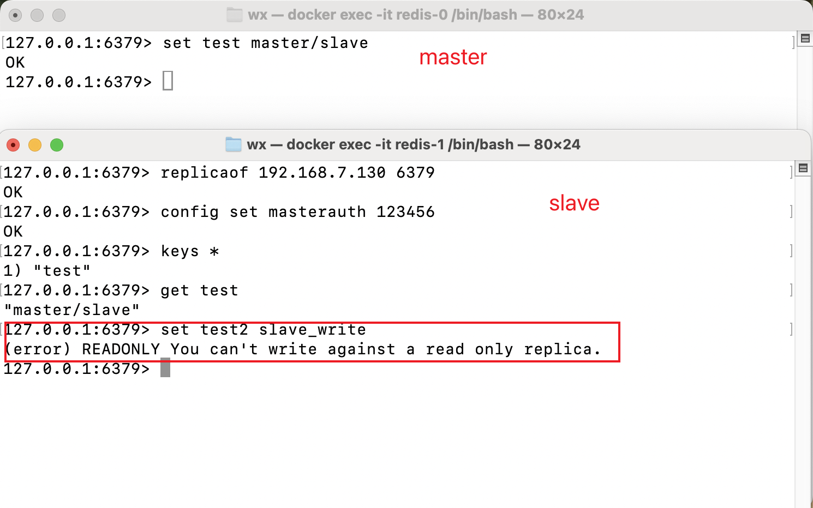
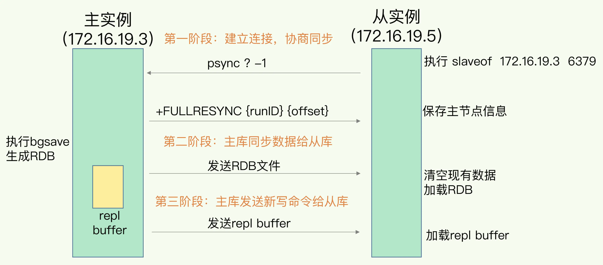
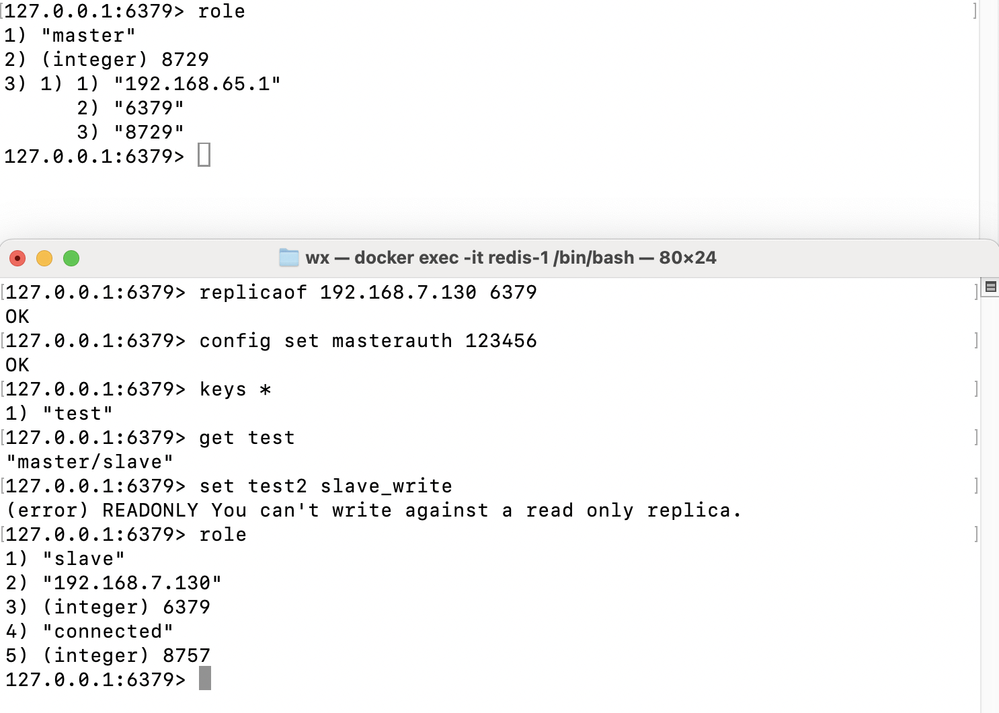

### Redis

#### 系统环境
- 系统：macOS
- 处理器：2.6 GHz 六核Intel Core i7
- 内存：16GB
- 版本：15.0

#### docker 安装
redis.config
```
# 60s 内有3个值变动，通过bgsave持久化
save 60 3

# bgsave 失败之后，是否停止持久化数据到磁盘，yes 表示停止持久化，no 表示忽略错误继续写文件。
stop-writes-on-bgsave-error yes


# RDB 文件压缩
rdbcompression yes


# rdb & aof 开启混合持久化
aof-use-rdb-preamble yes


requirepass 123456
appendonly yes
protected-mode no
port 6379
```

```shell
docker pull redis:@latest
docker run -d --name redis-1 \
  -e TZ='Asia/Shanghai' \
  -v /Users/wx/workspace/docker/redis/redis.conf:/usr/local/etc/redis/redis.conf \
  -v /Users/wx/workspace/docker/redis/data:/data \
  -p 6380:6379 \
  redis redis-server /usr/local/etc/redis/redis.conf
```

#### 常见数据类型

常用数据类型

String（字符串），Hash（哈希），List（列表），Set（集合）、Zset（有序集合）

新增数据类型

HyperLogLog（2.8 版新增）、GEO（3.2 版新增）、Stream（5.0 版新增）

##### 常用数据类型

1. String

   String 是最基本的 key-value 结构，key 是唯一标识，value 是具体的值，value其实不仅是字符串，也可以是数字（整数或浮点数），value 最多可以容纳的数据长度是 512MB
   
   基本用法

   ```shell
   # 设置一个键值对，以及过期时间
   set key value [NX|XX] [GET] [EX seconds|PX millise
   # 获取 key 对用 value
   get key
   ```
   
   应用场景
   
   - 缓存对象

      ```shell
      SET user:1 '{"name":"xiaolin", "age":18}'
      ```
     
   - 常规计数
      ```shell
      SET aritcle:readcount:1001 0
      incr aritcle:readcount:1001
      ```
   - 分布式锁
      ```shell
      SET lock_key unique_value NX PX 10000
      ```

2. List

   List(双向列表)列表是简单的字符串列表，按照插入顺序排序，可以从头部或尾部向 List 列表添加元素。

   基本用法

   ```shell
   # 向列表的头/尾部插入 n 个元素
   LPUSH/RPUSH key value...
   # 获取 列表 头/尾元素
   LPOP/RPOP key
   # 返回列表key中指定区间内的元素，区间以偏移量start和stop指定，从0开始
   LRANGE key start stop
   # 从key列表表头弹出一个元素，没有就阻塞timeout秒，如果timeout=0则一直阻塞
   BLPOP/BRPOP key timeout
   ```

   应用场景

   - 消息队列，生产者使用`LPUSH/RPUSH`往列表中插入消息，消费者使用`BRPOP/BLPOP`消费列表中的数据，保证了有序性，也确保了消费者阻塞式读取数据；生产者使用全局唯一ID确保不会重复消息处理；使用`BRPOPLPUSH`确保消息可靠

3. Hash

   Hash是一个键值对(key-value)，`value=[{field1, value1},{field2, value2},{fieldN, valueN}]`，比较适合存储对象

   基本用法

   ```shell
   # 存储一个哈希表的键值
   hset stu1 name wx age 12
   # 返回哈希表key中field的数量
   hlen stu1
   # 返回所有的键值
   hgetall stu1
   ```

   应用场景

   - 缓存对象，对于对象中某些频繁变化的属性可以用Hash类型来存储

      ```shell
      hset stu1 name wx age 12
      ```

4. Set

   Set类型是一个无序并唯一的键值集合，它的存储顺序不会按照插入的先后顺序进行存储。

   基本用法

   ```shell
   # 往集合key中存入元素，元素存在则忽略，若key不存在则新建
   sadd key member [member ...]
   # 从集合key中删除元素
   srem key member [member ...]
   # 获取所有元素
   smembers key
   # 获取集合中key中的数量
   scard key
   
   # 判断 member元素是否存在集合key中
   sismember key member
   
   # 从集合key中随机选出count个元素，元素不从key中删除
   srandmember key [count]
   
   # 从集合key中随机选出count个元素，元素从集合中删除
   spop key [count]
   
   ## 集合 交集、并集、差集运算 ....
   ```

   应用场景

   - 文章点赞，key是文章id，value是用户id
   
   ```shell
   ## 点赞
   sadd article:1 uid:1
   sadd article:1 uid:2
   sadd article:1 uid:3
   ## 取消点赞
   srem article:1 uid:1
   ## 查看所有点赞用户
   smembers article:1
   ```

   - 抽奖活动，集合中存储用户名

   ```shell
   ## 集合存储用户名
   sadd lockly user1 user2 user3 user4 user5 user6
   ## 抽取一个一等奖
   SRANDMEMBER lockly 1
   # 抽取2个二等奖
   SRANDMEMBER lockly 2
   # 抽取三个三等奖
   SRANDMEMBER lockly 3
   ```

5. Zset

   Zset是有序集合，相比Set类型多了一个排序属性score（分数），对于有序集合ZSet来说，每个存储元素相当于两个值组成的，一个是有序集合的元素值，一个是排序值

   基本用法

   ```shell
   # 往有序集合key中加⼊带分值元素
   ZADD key score member [[score member]...]
   # 往有序集合key中删除元素
   ZREM key member [member...]
   # 返回有序集合key中元素member的分值
   ZSCORE key member
   # 返回有序集合key中元素个数
   ZCARD key
   # 为有序集合key中元素member的分值加上increment
   ZINCRBY key increment member
   # 正序获取有序集合key从start下标到stop下标的元素
   ZRANGE key start stop [WITHSCORES]
   # 倒序获取有序集合key从start下标到stop下标的元素
   ZREVRANGE key start stop [WITHSCORES]
   # 返回有序集合中指定分数区间内的成员，分数由低到⾼排序。
   ZRANGEBYSCORE key min max [WITHSCORES] [LIMIT offset count]
   # 返回指定成员区间内的成员，按字典正序排列, 分数必须相同。
   ZRANGEBYLEX key min max [LIMIT offset count]
   # 返回指定成员区间内的成员，按字典倒序排列, 分数必须相同
   ZREVRANGEBYLEX key max min [LIMIT offset count]
   ```
   
   应用场景
   
   - 排行榜，文章浏览量排行榜
   
   ```shell
   # 初始化数据
   ZADD article:book 200 article:1 50 article:2 150 article:3 220 article:4 100 article:5
   # article:3 增加浏览量
   ZINCRBY article:book 1 article:3
   # 获取浏览量前三的文章和浏览量
   ZREVRANGE article:book 0 2 withscores
   ```

6. BitMap

   BitMap，位图是⼀串连续的⼆进制数组（0和1），可以通过偏移量（offset）定位元素。BitMap通过最⼩的单位bit
   来进⾏ 0|1 的设置，表示某个元素的值或者状态，时间复杂度为O(1)。

   基本用法

   ```shell
   # 设置值，其中value只能是 0 和 1
   SETBIT key offset value
   # 获取值
   GETBIT key offset
   # 获取指定范围内值为 1 的个数
   # start 和 end 以字节为单位
   BITCOUNT key start end
   
   # BitMap间的运算
   # operations 位移操作符，枚举值
   AND 与运算 &
   OR 或运算 |
   XOR 异或 ^
   NOT 取反 ~
   # result 计算的结果，会存储在该key中
   # key1 … keyn 参与运算的key，可以有多个，空格分割，not运算只能⼀个key
   # 当 BITOP 处理不同⻓度的字符串时，较短的那个字符串所缺少的部分会被看作 0。返回值是保存到 destkey
   BITOP [operations] [result] [key1] [keyn…]
   # 返回指定key中第⼀次出现指定value(0/1)的位置
   BITPOS [key] [value]
   ```
   
   应用场景

   - 签到统计，在签到打卡的场景中，我们只用记录签到(1)或未签到(0)

   ```shell
   # 用户 a 11月9日 签到
   SETBIT uid:a:202411 8 1
   # 检查该用户是否在 11月9日签到
   GETBIT uid:a:202411 8
   # 统计签到次数
   BITCOUNT uid:a:202411
   ```

7. Geo

   Geo 主要用于存储地理位置信息，并对存储的信息进行操作

   基本用法

   ```shell
   # 存储指定的地理空间位置，可以将⼀个或多个经度(longitude)、纬度(latitude)、位置名称(member)添加
   GEOADD key longitude latitude member [longitude latitude member ...]
   # 从给定的 key ⾥返回所有指定名称(member)的位置（经度和纬度），不存在的返回 nil。
   GEOPOS key member [member ...]
   # 返回两个给定位置之间的距离。
   GEODIST key member1 member2 [m|km|ft|mi]
   # 根据⽤户给定的经纬度坐标来获取指定范围内的地理位置集合。
   GEORADIUS key longitude latitude radius m|km|ft|mi [WITHCOORD] [WITHDIST] [WITHHASH
   ```
   
   应用场景

   - 滴滴叫车

   ```shell
   # 设置 司机(33)车辆位置
   GEOADD cars:locations 116.034567 39.030452 33
   # 用户的经纬度附近 5 公里你的车辆信息
   GEORADIUS cars:locations 116.054579 39.030453 5 km ASC COUNT 10
   ```

8. Stream

   Stream 实现了消息队列，支持消息的持久化、支持自动生成全局唯一ID、支持ack确认消息模式、支持消费组模式等

   基本用法

   ```
   XADD - 添加消息到末尾
   XTRIM - 对流进行修剪，限制长度
   XDEL - 删除消息
   XLEN - 获取流包含的元素数量，即消息长度
   XRANGE - 获取消息列表，会自动过滤已经删除的消息
   XREVRANGE - 反向获取消息列表，ID 从大到小
   XREAD - 以阻塞或非阻塞方式获取消息列表
   ```

   应用场景

   - 消息队列

   ```
   // todo
   ```

#### 持久化

三种持久化方式

- **快照方式**（RDB, Redis DataBase）将某一个时刻的内存数据，以二进制的方式写入磁盘；
- **文件追加方式**（AOF, Append Only File），记录所有的操作命令，并以文本的形式追加到文件中；
- **混合持久化方式**，Redis 4.0 之后新增的方式，混合持久化是结合了 RDB 和 AOF 的优点，在写入的时候，先把当前的数据以 RDB 的形式写入文件的开头，再将后续的操作命令以 AOF 的格式存入文件，这样既能保证 Redis 重启时的速度，又能减低数据丢失的风险。

##### RDB 持久化
RDB（Redis DataBase）是将某一个时刻的内存快照（Snapshot），以二进制的方式写入磁盘的过程。

RDB 的持久化触发方式有两类：一类是手动触发，另一类是自动触发。

1. 手动触发

   手动触发持久化的操作有两个： `save` 和 `bgsave` ，它们主要区别体现在：是否阻塞 Redis 主线程的执行
   
    - `save`：在客户端执行`save`命令，就会触发持久化，会是Redis进入阻塞状态，慎用
    - `bgsave`：bgsave(background save)，通过fork()一个子进程来执行持久化，只有当创建子进程时会有**短暂阻塞**。

2. 自动触发

   `save m n` 是指在 m 秒内，如果有 n 个键发生改变，满足设置的触发条件，自动执行一次 `bgsave` 命令
   
   `flushall` 命令用于清空Redis数据库，并把RDB文件清空

3. 设置配置，在`redis-cli`操作
   ```shell
   config get dbfilename
   config get dir
   config set dir "" # 设置持久化路径
   config set save "" # 禁止持久化
   ```
   
4. RDB 优缺点

   优点
   
   - RDB 的内容为二进制的数据，占用内存小，更紧凑，适合作为备份文件
   - RDB 备份使用的是子进程进行数据持久化至磁盘，不会影响住进程

   缺点

   - 只能保存某个时间间隔的数据，中途Redis服务意外终止，数据会丢失
   - fork()子进程会将数据持久化至磁盘，数据集很大，持久化CPU性能不佳，会影响到住进程

##### AOF 持久化

AOF（Append Only File）中文是附加到文件，顾名思义 AOF 可以把 Redis 每个键值对操作都记录到文件（appendonly.aof）中。

1. 持久化配置

   ```shell
   config get appendonly #查询 AOF是否启动
   config set appendonly yes # 启动 AOF
   config set appendonly no # 关闭 AOF
   ```

   `redis.conf`中的配置文件中设置`appendonly yes`即可开启AOF

2. 触发持久化

   触发条件有两种自动触发和手动触发

   - 自动触发，满足AOF设置的策略触发，`config get appendonly`，获取AOF策略，主要策略

     - always：每条Redis操作命令都会写入磁盘，最多丢失一条数据
     - everysec：每秒钟写入一次磁盘，最多丢失一秒的数据
     - no：不设置写入磁盘的规则，根据当前操作系统来决定何时写入磁盘，Linux默认30s写入一次数据至磁盘

   - 手动触发，在客户端执行`bgrewriteaof`命令，可以触发文件重写

3. 文件重写

   AOF 是通过记录 `Redis` 的**执行命令**来持久化（保存）数据的，不断对`Redis`执行命令`AOF`文件会越来越多，这样不仅增加了服务器的存储压力，也会造成 `Redis` 重启速度变慢，为了解决这个问题 Redis 提供了 AOF 重写的功能。主线程 fork 出后台的 `bgrewriteaof` 子进程,bgrewriteaof 子进程就可以在不影响主线程的情况下，逐一把拷贝的数据写成操作，记入重写日志

   - `auto-aof-rewrite-min-size`允许 AOF 重写的最小文件容量，默认是 64mb
   - `auto-aof-rewrite-percentage`AOF 文件重写的大小比例，默认值是 100，表示 100%

4. 优缺点

   优点

   - AOF 持久化保存的数据更加完整，最多只会丢失 1s 钟的数据
   - AOF 采用的是命令追加的写入方式，所以不会出现文件损坏的问题
   - AOF 持久化文件，非常容易理解和解析，它是把所有 Redis 键值操作命令，即使使用`flushall`也可以恢复数据
   
   缺点

   - 对于相同的数据集来说，AOF 文件要大于 RDB 文件
   - 在 Redis 负载比较高的情况下，RDB 比 AOF 性能更好

##### RDB & AOF 混合持久化

`config set aof-use-rdb-preamble yes`开启混合持久化

当开启了混合持久化时,在 AOF 重写日志时,`fork`出来的重写子进程会先将与主线程共享的内存数据以 RDB 方式写入到 AOF 文件，然后主线程处理的操作命令会被记录在重写缓冲区里，重写缓冲区里的增量命令会以 AOF 方式写入到 AOF 文件，写入完成后通知主进程将新的含有 RDB 格式和 AOF 格式的 AOF 文件替换旧的的 AOF 文件。

优缺点

   优点

   - 开头为 RDB 的格式，使得 Redis 可以更快的启动，同时结合 AOF 的优点，有减低了大量数据丢失的风险

   缺点

   - AOF 文件中添加了 RDB 格式的内容，使得 AOF 文件的可读性变得很差
   - 不能兼容redis4.0之前的版本

#### Redis 过期策略

##### 设置过期时间

1. 使用`pexpire`

   - `expire key seconds`：设置 key 在 n 秒后过期
   - `pexpire key milliseconds`：设置 key 在 n 毫秒后过期
   - `expireat key timestamp`：设置 key 在某个时间戳（精确到秒）之后过期
   - `pexpireat key millisecondsTimestamp`：设置 key 在某个时间戳（精确到毫秒）之后过期

2. 字符串中的过期操作

   - `set key value ex seconds`：设置键值对的同时指定过期时间（精确到秒）
   - `set key value px milliseconds`：设置键值对的同时指定过期时间（精确到毫秒）
   - `setex key seconds valule`：设置键值对的同时指定过期时间（精确到秒）

3. 移除过期时间

   `persist key` 可以移除键值的过期时间

##### 持久化中的过期键

RDB，从内存状态持久化成 RDB（文件）的时候，会对 key 进行过期检查，过期的键不会被保存到新的 RDB 文件中，因此 Redis 中的过期键不会对生成新 RDB 文件产生任何影响

AOF，如果数据库某个过期键还没被删除，那么 AOF 文件会保留此过期键，当此过期键被删除后，Redis 会向 AOF 文件追加一条 DEL 命令来显式地删除该键值。重写之后不会被保存

##### 过期策略

Redis 会删除已过期的键值，以此来减少 Redis 的空间占用，但因为 Redis 本身是单线的，如果因为删除操作而影响主业务的执行就得不偿失了，为此 Redis 需要制定多个（过期）删除策略来保证糟糕的事情不会发生

常见的过期策略：定时删除、惰性删除、定期删除

- 定时删除

   在设置键值过期时间时，创建一个定时事件，当过期时间到达时，由事件处理器自动执行键的删除操作

   - 优点：保证内存可以被尽快释放
   - 缺点：在Redis高负载的时，会造成Redis服务器卡顿

- 惰性删除

  不主动删除过期键，每次从数据库获取键值时判断是否过期，如果过期则删除键值，并返回 null

  - 优点：每次访问时，才会判断过期键，只使用了很少的系统资源
  - 缺点：系统占用空间删除不及时，导致空间利用率降低，造成了一定的空间浪费

- 定期删除

   每隔一段时间检查一次数据库，随机删除一些过期键，配置`hz 10`

  - 优点：通过限制删除操作的时长和频率，来减少操作对Redis主业务的影响，同时也能删除一部份过期的数据
  - 缺点：内存清理方面没有定时删除效果好，同时没有惰性删除使用的系统资源少

总结：Redis 使用的是惰性删除加定期删除的过期策略


#### Redis 内存淘汰

当 Redis 运行内存已经超过 Redis 设置的最大内存之后，将采用什么策略来删除符合条件的键值对，以此来保障 Redis 高效的运行，其中64位操作系统的没有对内存大小做限制，`config get maxmemory`查看内存限制。

##### 内存淘汰策略

1. 内存淘汰策略分类

   - `noeviction`：不淘汰任何数据，当内存不足时，新增操作会报错，Redis 默认内存淘汰策略；
   - `allkeys-lru`：淘汰整个键值中最久未使用的键值；
   - `allkeys-random`：随机淘汰任意键值;
   - `volatile-lru`：淘汰所有设置了过期时间的键值中最久未使用的键值；
   - `volatile-random`：随机淘汰设置了过期时间的任意键值；
   - `volatile-ttl`：优先淘汰更早过期的键值。
   - `volatile-lfu`：淘汰所有设置了过期时间的键值中，最少使用的键值；
   - `allkeys-lfu`：淘汰整个键值中最少使用的键值。

   其中 allkeys-xxx 表示从所有的键值中淘汰数据，而 volatile-xxx 表示从设置了过期键的键值中淘汰数据。

2. 修改 Redis 内存淘汰策略

   - 通过`config set maxmemory-policy xxx` 命令设置。它的优点是设置之后立即生效，不需要重启 Redis 服务，缺点是重启 Redis 之后，设置就会失效
   - 通过修改 Redis 配置文件修改，设置`maxmemory-policy xxx`，它的优点是重启 Redis 服务后配置不会丢失，缺点是必须重启 Redis 服务，设置才能生效

##### 内存淘汰算法

1. LRU算法

   LRU 全称是 Least Recently Used 译为最近最少使用，是一种常用的页面置换算法，选择最近最久未使用的页面予以淘汰

2. LFU算法

   LFU 全称是 Least Frequently Used 翻译为最不常用的，最不常用的算法是根据总访问次数来淘汰数据的，它的核心思想是“如果数据过去被访问多次，那么将来被访问的频率也更高”

##### 主从同步

主从模式（Master-Slave）是Redis实现读写分离和提高容灾能力的基础。一个主节点（Master）可以有多个从节点（Slave）。

1. 特点

   - 读写分离：主节点负责写入，从节点负责读取，减轻主节点的读压力。
   - 故障转移：如果主节点故障，可以手动或通过其他工具将从节点提升为主节点。
   - 数据同步：从节点通过复制（Replication）获取主节点数据。

2. 配置主从

   - 主节点，无需额外配置
   - 从节点，可以修改`redis.conf`文件，添加设置从节点连接主节点`replicaof <master_ip> <master_port>`和配置主节点密码`masterauth <master_password>`，进行持久化配置。
   也可以在`redis-cli`适用命令进行配置，如下
   
     ```shell
     127.0.0.1:6379> replicaof 192.168.7.130 6379
     OK
     127.0.0.1:6379> config set masterauth 123456
     OK
     ```

3. 功能测试

   首先我们先在主服务器上执行保存数据操作，再去从服务器查询，从服务器只能查询数据

   

4. 主从数据同步

   新的从服务器连接时，为了保障多个数据库的一致性，主服务器会执行一次 bgsave 命令生成一个 RDB 文件，然后再以 Socket 的方式发送给从服务器，从
服务器收到 RDB 文件之后再把所有的数据加载到自己的程序中，就完成了一次全量的数据同步。

   

   主从数据同步，还会出现：主从库间网络断了怎么办？主从同步的细节。主从之间的`buffer`等等，暂且作为遗留问题 `todo`

5. 查询服务器角色

   使用 `role` 命令，来查询当前服务器的主从角色信息

   

   关闭主从同步，使用 `replicaof no one` 命令来停止从服务器的复制

#### Redis 哨兵

#### Redis 集群

Redis采用集群的主要目的是为了解决单机性能和容量的限制问题，增加了高可用性

##### 集群的选择

1. Redis Cluster

   Redis 自带的原生集群莫斯，支持数据分片

   特点：

   - 分片算法：由客户端决定分片规则，通常采用一致性哈希
   - 灵活性搞：客户端完全掌控分片逻辑
   - 无高可用支持：需要客户端额外管理主从关系和故障管理
   
   使用场景：

   - 数据分布策略需要高度定制化
   - 不需要复杂的高可用管理，或已有外部的高可用方案

2. Codis

   Codis 是由国人开发的开源Redis分布式代理解决方案，旨在帮助用户管理多个Redis实例，**不在更新**

   特点：

   - 隐藏了分片逻辑，客户端只需要连接Proxy，不需要感知底层的分布式结构
   - 支持横向扩展，多个Proxy可共同分担流量
   - 支持高可用，Proxy故障时，客户端可以切换到其他Proxy

   使用场景：

   - 数据规模大
   - 请求并发量高

Redis Cluster 与 Codis 的对比

| 特性     | Redis Cluster           | Codis                      |
|--------|-------------------------|----------------------------|
| 分片实现   | 数据分布到16384个哈希槽，有节点负责    | 基于 Proxy，由 Codis 管理分片规则    |
| 客户端透明性 | 需要支持Cluster协议的客户端       | 完全透明，客户端无需感知               |
| 动态扩容   | 数据迁移较复杂，需手动操作           | 支持在线迁移分片                   |
| 高可用性   | 原生支持高可用，自主选举主节点         | 	依赖 Redis 主从复制和 Proxy 故障切换 |
| 使用复杂度  | 相对简单，原生功能               | 相对复杂，需要运维 ZooKeeper/Etcd	  |
| 场景适用性  | 新系统开发，支持Redis Cluster协议 | 适合老系统改造，无需更改业务代码           |


##### 实操

#### Redis 性能测试


