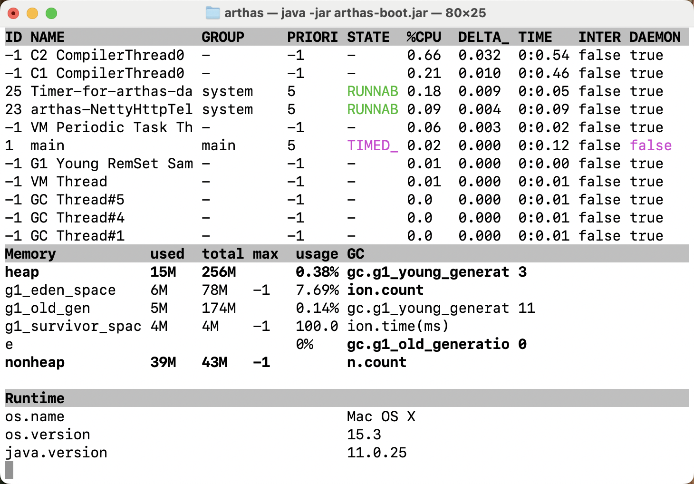
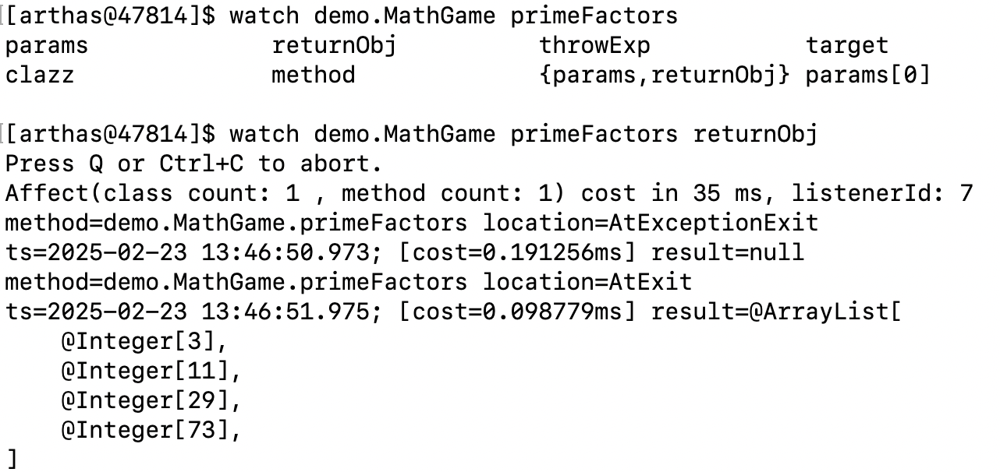
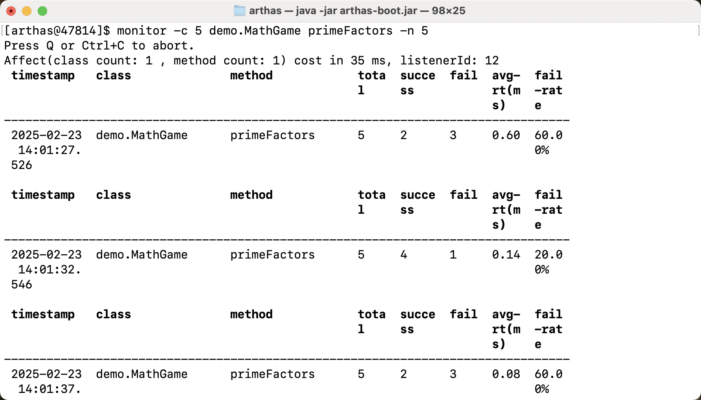
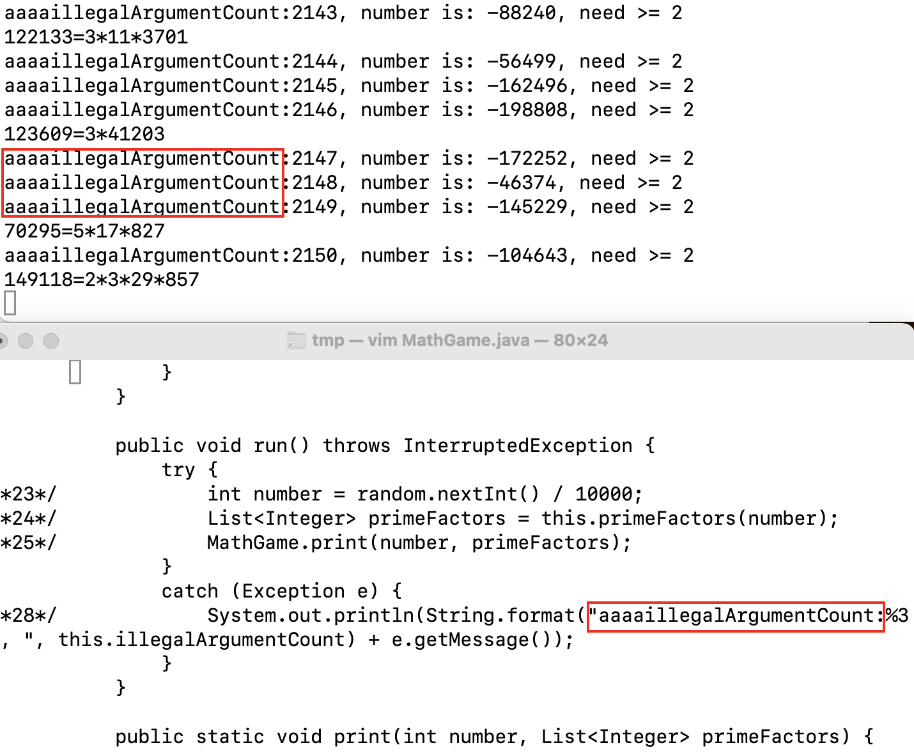

# Arthas

Arthas 是阿里巴巴开源的一款线上监控诊断产品，实时查看应用 load、内存、gc、线程的状态信息，并能在不修改应用代码的情况下，对业务问题进行诊断，包括查看方法调用的出入参、异常，监测方法执行耗时，类加载信息等。  

这里主要是学习和实践 Arthas，[原文参见](https://arthas.aliyun.com/doc/)

## 安装与启动

```sh
curl -O https://arthas.aliyun.com/arthas-boot.jar
java -jar arthas-boot.jar
```

启动后选择要监控的Java进程

## 常用命令

`dashboard`：实时监控系统性能，包括线程、内存、GC等



`thread`：查看线程信息，如`thread -n 3`显示最忙的3个线程，`thread 1 | grep "main"`可以查看线程什么方法的线程

`jad`：反编译类文件，如`jad demo.MathGame`

`watch`：监控方法入参、出参，如`watch demo.MathGame primeFactors {params, returnObj}`，按`tab`有提示


监控入参参数<2的两次调用
```shell
watch demo.MathGame primeFactors params 'params[0]<2' -n 2
# 对参数进行过滤适用于 watch/trace/stack
```

`trace`：方法内部调用路径，并输出方法路径上的每个节点上耗时，如`trace demo.MathGame run -n 1`，`-n 1`指捕捉几次之后就退出

`stack`：查看方法被调用路径，如`stack demo.MathGame primeFactors`

`monitor`：统计方法调用次数和耗时，如`monitor -c 5 demo.MathGame primeFactors`


## 场景实战

### 查看最繁忙的线程，以及是否有阻塞情况发生
```shell
# 查看最繁忙的三个线程栈信息
thread -n 3
# 以直观的方式展现所有的线程情况
thread
# 找出当前阻塞其他线程的线程
thread -b
```

### 确认某个类是否已被系统加载
```shell
# 即可以找到需要的类全路径，如果存在的话
sc *MathGame

# 查看这个某个类所有的方法
sm demo.MathGame *

# 查看某个方法的信息，如果存在的话
sm demo.MathGame testMethod  
```

### 如何查看一个class类的源码信息
```shell
# 直接反编译出java 源代码，包含一此额外信息的
jad demo.MathGame
```

### 找到最耗时的方法调用?
```shell
# 执行的时候每个子调用的运行时长，可以找到最耗时的子调用。
trace demo.MathGame primeFactors
```

### 如何临时更改代码运行?
```shell
# 先反编译出class源码
jad jad --source-only demo.MathGame > /tmp/MathGame.java  

# 然后使用外部工具编辑内容
mc /tmp/MathGame.java -d /tmp  # 再编译成class

# 最后，重新载入定义的类，就可以实时验证你的猜测了
redefine /tmp/demo/MathGame.class
```



上述可以实现对应用程序在线查看运行状态、参数、调用时间等信息，以及可以实现临时修改代码进行观察

# JProfiler

JProfiler 是一款功能强大的商用 Java 性能分析工具，它为开发者提供了详细的性能分析和内存泄漏检测等功能